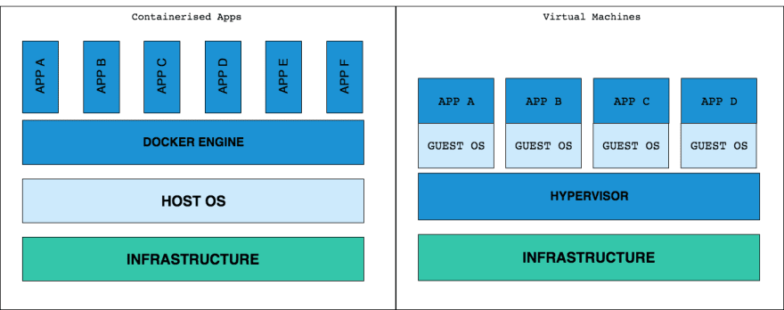
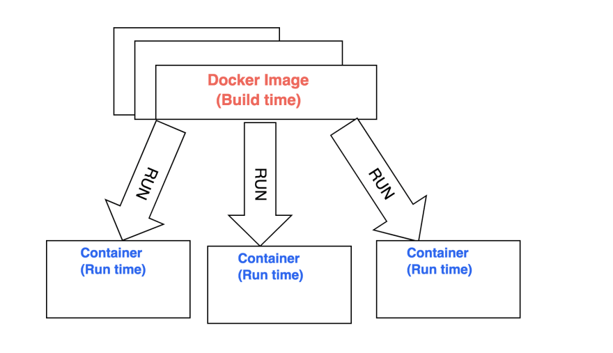

[toc]

## book

* 《第一本Docker书》
* 《Docker技术入门与实战》
* 《Docker实战》
* 《Kubernetes权威指南：从Docker到Kubernetes实践全接触》

## 社区

* [docker中文社区](http://www.docker.org.cn/index.html)
* [docker hub](https://hub.docker.com/)
  * docker hub是Docker公司维护的公共镜像源
  * docker hub也可以保存自己的私有镜像

## 文档 & 教程

* [docker官方文档](https://docs.docker.com/get-started/)
* [Docker — 从入门到实践](https://yeasy.gitbooks.io/docker_practice/)

* [✅ A beginner’s guide to Docker (1)— how to create your first Docker application](https://medium.freecodecamp.org/a-beginners-guide-to-docker-how-to-create-your-first-docker-application-cc03de9b639f)
  * 举例一个 Python hello world
  * Dockerfile 概念
* [✅ A beginner’s guide to Docker (2)— how to create a client/server side with Docker-Compose](https://medium.freecodecamp.org/a-beginners-guide-to-docker-how-to-create-a-client-server-side-with-docker-compose-12c8cf0ae0aa)
  * 实例通过Docker-Compose同时启动多个镜像
* [✅ Docker For Frontend Developers](https://dev.to/akanksha_9560/docker-for-frontend-developers-1dk5)
  * docker 和虚拟机vm的差异
    * Every VM needed entire OS to run. Every OS needs CPU, RAM etc to run, it needs patching and licensing, which in turn increases cost and resiliency.
    * Google started using containers model long time ago to address shortcomings of VM model. docker container model means that multiple containers on same host uses same host, freeing up CPU, RAM which could be used elsewhere
  
  * 一个简单的node服务实例


* [5 part Docker series, beginner to master](https://dev.to/softchris/5-part-docker-series-beginner-to-master-3m1b?utm_source=Newsletter+Subscribers&utm_campaign=bffcdce188-EMAIL_CAMPAIGN_2019_03_11_07_39&utm_medium=email&utm_term=0_d8f11d5d1e-bffcdce188-154395145)
  * [Docker part I - basics ](https://dev.to/azure/docker---from-the-beginning-part-i-28c6)
    * Why Docker
      * onboarding 包含所有依赖项，更换部署环境时非常方便
  * [Docker part II - volumes](https://dev.to/azure/docker-from-the-beginning---part-ii-5g8n)
    * Using a volume
      * 开发阶段，我们可能需要修改代码，删除已经启动的当前container，重新生成修改后的代码的镜像，重新启动镜像, 这样比较麻烦，然后我们可以使用volumes实现直接修改源码而不必反复重启container (==demo中没有成功==，貌似Mounting a volume in your application 这一步没有生效)
  * [Docker part III - databases, linking and networks](https://dev.to/azure/docker-from-the-beginningpart-iii-2h51)
  * [Docker part IV - introducing Docker Compose](https://dev.to/azure/docker-from-the-beginning-partiv-mi6)
  * [Docker part V- going deeper with Docker Compose ](https://dev.to/azure/dockerfrom-the-beginning-part-v-n2c)


* [Complete Node js Project Setup from Docker to Testing-[Docker |RESTfull APIs with Node.js | Express.js | MongoDB | Integration Testing with JEST]](https://medium.com/@nur_islam/complete-node-js-project-setup-from-docker-to-testing-docker-restfull-apis-with-node-js-9f384e06734a)


## 知识点
### 安装docker
* [mac](https://docs.docker.com/docker-for-mac/install/)
* [win](https://docs.docker.com/docker-for-windows/install/)
* Ubuntu
```sh
sudo apt update
sudo apt-get install docker-ce

sudo docker run hello-world # verify that Docker is installed correctly
```

### 相关词汇
* 镜像image:  It is an executable file which contains cutdown operating system and all the libraries and configuration needed to run the application. It has multiple layers stacked on top of each other and represented as single object
* 容器container: It is a running instance of docker image. there can be many containers running from same docker image



### Dockerfile
```SH
# A dockerfile must always start by importing the base image.
# We use the keyword 'FROM' to do that.
# In our example, we want import the python image.
# So we write 'python' for the image name and 'latest' for the version.
FROM python:latest

# In order to launch our python code, we must import it into our image.
# We use the keyword 'ADD' to do that.
# The first parameter 'main.py' is the name of the file on the host.
# The second parameter '/' is the path where to put the file on the image.
# Here we put the file at the image root folder.
ADD main.py /

# We need to define the command to launch when we are going to run the image.
# We use the keyword 'CMD' to do that.
# The following command will execute "python ./main.py".
CMD [ "python", "./main.py" ]

```

#### 基础指令
* FROM 导入base镜像 `FROM imageName:version`
* ADD 添加文件到镜像 `ADD file targetPathInImage`
* CMD run image时执行的命令 `CMD [ "instructName", "arguments" ]`   `CMD [ "python", "./main.py" ]`
* `RUN npm install` 在镜像里执行 `npm install`
* `EXPOSE 8081` 暴露端口 （默认会忽略所有端口的请求）
* `ENTRYPOINT ["node", "app.js"]` state how we start up our application
* 配置环境变量 ENV
```BASH Dockerfile
ENV PORT=3000
EXPOSE $PORT
```
然后就可以在`process.env.PORT`中读取配置的环境变量PORT


### CLI 指令
* build镜像 `docker build -OPTIONS IMAGE-NAME .`
  * `-t` is used to give a name to our image 
  * `.` is the relative path to docker file, since we are in folder my-node-app we used dot to represent path to docker file.
  >`docker build -t python-test .`

* 启动镜像 `docker run IMAGE-NAME`
  * Daemon mode `-d` （runs as a background process, ）
  * Interactive mode （this allows us to step into a running container ）`docker exec -it container-name bash`
  * `--name container-name`
  > `docker run python-test`
* `docker image ls` 列出已经存在的所有镜像
* `docker image rm [image name]` 删除某个镜像
* `docker image rm $(docker images -a -q)` 删除所有镜像
* `docker ps -a` 列出所有容器
* `docker stop [container name]` 停止某个容器的运行
* `docker stop $(docker ps -a -q)` 停止所有容器的运行
* `docker rm [container name]` 删除某个容器
* `docker rm $(docker ps -a -q)` 删除所有容器
* `docker logs [container name]` 展示某个容器的日志

* docker stop vs docker kill
  * `docker stop` bring down the container, release resources and saving state
  * `docker kill` resource release or state save might not work as intended， 在生产环境使用stop更好
