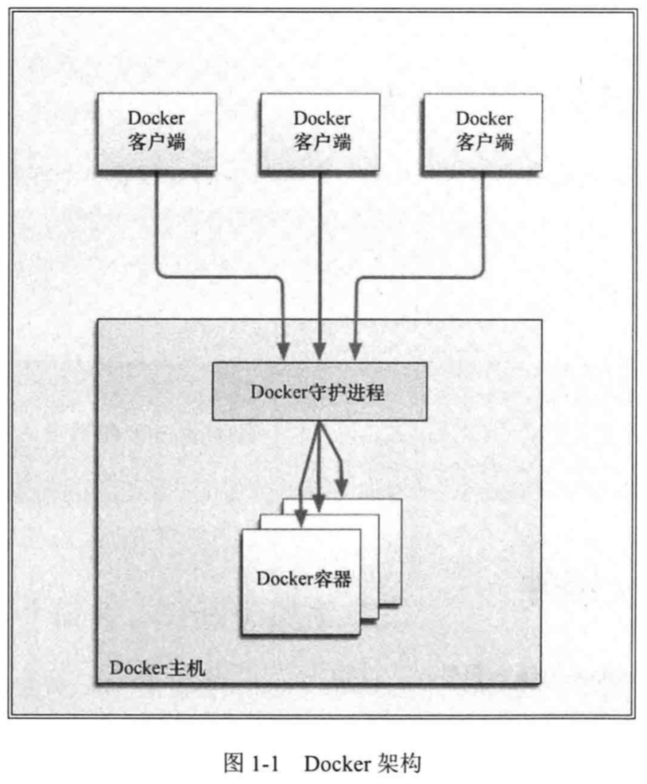
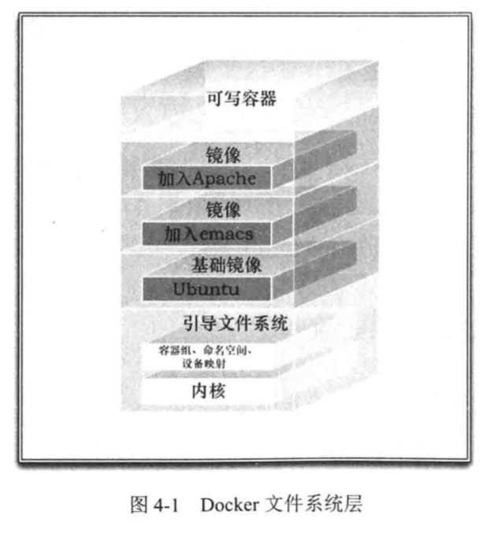

[TOC]

# 第一本Docker书

出版时间：2015.1

Docker的核心价值在于解决软件运行的依赖环境问题。传统的软件交付时，软件的运行环境无法控制和标准化。Docker将软件及其“依赖的环境”打包在一起，以镜像的形式交付。

Docker构造了一个“轻量虚拟环境”，传统虚拟机的绝大多数场景可以被Docker取代。

## 第一章 简介

### 1.1 Docker简介

* 职责分离：开发只需要关心容器中运行的应用程序，而运维只需要关系如何管理容器

### 1.2 Docker组件

Docker的核心组件有：

* Docker客户端和服务端；
* Docker镜像；
* Registry;
* Docker容器;

;

* 镜像是Docker生命周期中的构建或打包阶段，而容器则是启动或执行阶段；

### 1.3 我们能用Docker做什么

* 加速本地开发和构建流程；
* 创建隔离的用于CI的测试环境；
* 为开发、测试提供一个轻量级的沙盒环境，或者将独立的沙盒环境用于教学，如Unix shell的使用、编程语言教学等；
* 作为高性能、超大规模的宿主机部署；

### 1.4 Docker与配置管理

Docker容器需要编排、管理和部署。

### 1.5 Docker的技术组件

* 文件系统隔离：每个容器都有自己的root文件系统；
* 进程隔离：每个容器都运行在自己的进程环境中；
* 网络隔离：容器的虚拟网络接口和IP地址都是分开的；
* 资源隔离和分组：将CPU和内存之类的资源独立分配给每个容器；
* 写时复制；
* 交互式shell;

## 第2章 安装Docker

## 第3章 Docker入门

### 3.1 确保Docker已经就绪

执行`docker info`确认docker是否能正常工作，该命令返回所有容器和镜像的数量、Docker使用的执行驱动和存储驱动以及Docker的基本配置。

### 3.2 运行我们的第一个容器

可以通过`docker run`创建容器。

```
sudo docker run -i -t ubuntu /bin/bash
```
* -i 标志保证容器中STDIN是开启的；
* -t标志为要创建的容器分配一个伪tty终端；

首先docker会检查本地是否存在ubantu镜像，如果不存在则到官方镜像库Docker Hub查找该镜像，如果有，则下载该镜像并保存到宿主机器中。随后，使用这个镜像创建了一个新容器。

执行`docker help run`可以查看docker run命令可用的所有标志。

### 3.3 使用第一个容器

### 3.4 容器命名

docker会为我们创建的容器自动生成一个随机的名称，通过--name可以指定自定义的名称
```
sudo docker run --name bob_the_container -i -t ubuntu /bin/bash
```

* 合法的容器名称只能包含：小写字符a~z、大写字母A~Z、数字0~9、下划线、圆点、横线。

* 如果视图创建的容器的名称已经存在，则会创建失败，需要执行docker rm命令删除已有的同名容器后，再创建新的容器；

### 3.5 重新启动已经停止的容器

可以使用容器名称或者容器ID来指定启动的容器
```
sudo docker start bob_the_container
```
我们也可以使用restart命令

```
sudo docker restart aa3f365f0f4e
```

### 3.6 附着到容器上

重新启动容器时，会沿用docker run命令指定的参数来运行，此外，我们也可以使用`docker attach`命令重新附着到该容器的会话上：

可以指定容器名称或者ID
```
sudo docker attach bob_the_container
```

### 3.7 创建守护式容器

创建守护式容器，没有交互式会话，适合运行应用程序和服务。
```
sudo docker run --name daemon_dave -d ubuntu /bin/sh -c "while true; do echo hello world; sleep 1; done"
```

上面的命令使用了`-d`（detached）参数，这样创建的容器将会放到后台运行；

这个命令不会将主机的控制台附着到新的容器的shell会话上，而是仅仅返回一个容器的ID。

我们执行`docker ps`命令可以看到创建的容器正在运行

### 3.8 容器内部都在干些什么

为了探究容器内部在干什么，我们可以执行`docker logs`命令来获取容器的日志
```
sudo docker logs daemon_dave
```
可以看到在循环输出hello world

可以使用`-f`参数来监控Docker日志，这与`tail -f`命令非常相似。
```
sudo docker logs -f daemon_dave
```

还可以指定只获取最后10行
```
sudo docker logs --tail 10 daemon_dave
```

### 3.9 查看容器内的进程

我们可以使用`docker top`命令查看容器内部运行的进程
```
sudo docker top daemon_dave
```

### 3.10 在容器内部运行进程

Docker 1.3之后，我们可以执行`docker exec`命令在容器内部额外启动新进程。
```
sudo docker exec -d daemon_dave touch /etc/new_config_file
```
* `-d`表示启动一个后台进程
* `-d`后面指定执行这个命令的容器的名字及要执行的命令

也可以启动一个交互式任务
```
sudo docker exec -t -i daemon_dave /bin/bash
```
有了这个交互式会话，我们就可以在该容器中运行其他命令了。

### 3.11 停止守护式容器

可以通过`docker stop`命令来停止守护式容器
```
sudo docker stop daemon_dave
```
也可以使用容器ID替代容器名称

### 3.12 自动重启容器

如果由于某种错误导致容器停止运行，我们可以通过`--restart`标志，让Docker自动重新启动容器。默认的行为是Docker不会重启容器。

```
sudo docker run --restart=always --name daemon_dave -d ubuntu /bin/sh -c "while true; do echo hello world; sleep 1; done"
```

* `--restart=always`表示无论容器退出代码是什么都会自动重启；
* 可以指定为`on-failure`这样当容器退出代码非0值时才会自动重启，另外`on-failure`还可以接受一个可选的重启次数参数,`--restart=on-failure:5`,这样表示最多重启5次

### 3.13 深入容器

通过`docker inspect`命令可以获取更多的容器信息
```
sudo docker inspect daemon_dave
```

### 3.14 删除容器

可以使用`docker rm`命令来删除不再使用的容器

```
sudo docker rm daemon_dave
```
运行中的容器无法删除，需要先通过`docker stop`或者`docker kill`命令停止容器，然后才能将其删除

目前没有办法一次删除所有容器，不过可以通过下面的命令来删除全部容器
 
```
docker rm `docker ps -a -q`
```
* `-a`标志代表列出所有容器
* `-q`标志则表示只需要放回容器ID而不返回容器的其他信息

## 第4章 使用Docker镜像和仓库

### 4.1 什么是Docker镜像

Docker镜像是由文件系统叠加而成，最底层是一个引导文件系统，即bootfs。当容器启动后，它将会被移到内存中，而引导文件系统则会被卸载。

docker将用于加载的文件系统称为镜像。



### 4.2 列出镜像

列出Docker主机上可用的镜像
```
sudo docker images
```

镜像保存在仓库中，可以将镜像仓库想象成类似Git仓库的东西，它包括镜像、层及关于镜像的元数据。

我们在启动时可以通过在仓库名后面加一个冒号和标签名来指定该仓库中的某一镜像
```
sudo docker run -r -i --name new_container ubuntu:12.04 /bin/bash
```

Docker Hub中存在两种类型的仓库：用户仓库（其中的镜像有Docker用户创建）和顶层仓库（由Docker内部的人管理）

用户仓库的命名由用户名和仓库名组成，如：jamtur01/puppet。
与之相对，顶层仓库只包含仓库名部分。
用户贡献的镜像是由Docker社区用户提供的，使用时需要自己承担相应的风险。

### 4.3 拉取镜像 docker pull [imageName]

docker run启动一个容器时，如果相应的镜像不存在本地，Docker会从Docker Hub下载镜像，如果没有指定镜像标签，那么Docker 会自动下载latest标签的镜像。

当然也可以提前通过docker pull命令预先拉取镜像到本地。
```
sudo docker pull [imageName]
```

### 列出本地镜像的不同版本 docker images [imageName]

### 4.4 查找镜像 docker search [imageName]
```
sudo docker search puppet
```


### 4.5 构建镜像

构建镜像有两种方法：

* 使用docker commit命令
* 使用docker build命令和Dockerfile命令

不推荐使用docker commit的方式，使用Dockerfile更灵活。

#### 4.5.1 创建Docker Hub账号

#### 4.5.2 用Docker的commit命令创建镜像

1. 首先创建一个新的容器

```
sudo docker run -i -t ubuntu /bin/bash
```

2. 接下来，在容器中安装Apache

```
apt-get -yqq update
apt-get -y install apache2
```

为了把当前状态保存下来，这样就不必每次都创建一个新的容器，然后再安装Apache，我们可以先使用exit命令从容器中退出，之后再使用docker commit命令：
```
sudo docker commit 4aab3ce3cb76 jamtur01/apache2
```
上面的4aab3ce3cb76是之前创建的容器的id，jamtur01/apache2是要提交的仓库的名称
我们可以通过`docker ps -l -q`命令得到刚创建的容器的ID

需要注意的是docker commit提交的只是创建容器的镜像与容器的当前状态之间有差异的部分，这使得该更新非常轻量。

也可以在提交镜像时指定更多的数据（包括标签）来详细描述所做的修改
```
sudo docker commit -m="A new custom image" --author="James Turnbull" 4aab3ce3cb76 jamtur01/apache2:webserver
```
* `-m`指定创建镜像时的提交信息
* `--author`指定创建镜像的作者
* 接着指定了想要提交的容器的ID
* 最后`jamtur01/apache2:webserver`指定了镜像的用户名和仓库名，并为该镜像增加了一个webserver标签

最后，可以使用`docker inspect`命令来查看创建的镜像的详细信息

#### 4.5.3 用Dockerfile构建镜像

Dockerfile使用基本的基于DSL语法的指令构建一个Docker镜像，之后使用docker build命令基于该Dockerfile中的指令构建一个新的镜像。

```bash
mkdir static_web
cd static_web
touch Dockerfile
```
Dockerfile
```
# Version: 0.0.1
FROM ubuntu:14.04
MAINTAINER James Turnbull "james@example.com"
RUN apt-get update
RUN apt-get install -y nginx
RUN echo 'Hi, I am in your container' \ >/usr/share/nginx/html/index.html
EXPOSE 80
```

* Dockerfile由一系列指令和参数组成，每条指令都必须为大写字母，后面要跟一个参数，Dockerfile指令会按照顺序从上到下执行；
* 每条指令都会创建一个新的镜像层并对镜像进行提交；
* Dockerfile支持注释。以`#`开头的行都会被认为是注释；

Docker大体上按照如下流程执行Dockerfile中的指令：

* Docker从基础镜像中运行一个容器；
* 执行一条指令，对容器作出修改；
* 执行类似docker commit的操作，提交一个新的镜像层；
* Docker再基于刚提交的镜像运行一个新的容器；
* 执行Dockerfile中的下一条执行，直到所有指令都执行完毕；

上面创建的 Dockerfile中的指令：
* FROM指令：指定一个已经存在的基础镜像，每个Dockerfile的第一条都应该是FROM；
* MAINTAINER指令：告诉Docker该镜像的作者是谁及作者的邮件地址
* RUN指令：会在当前镜像中运行指定的命令
  * 默认的情况下RUN指令会在shell里使用命令包装器`/bin/sh -c`来执行，也可以通过exec格式执行RUN指令：`RUN ["apt-get", " install", "-y", "nginx"]`
* EXPOST指令：告诉Docker该容器中的应用程序将会使用容器的指定端口
  * 可以指定多个EXPOST指令来向外公开多个端口

#### 基于Dockerfile构建新镜像

执行`docker build`Dockerfile中的指令会被执行并且提交，命令成功结束后返回一个新镜像
```
cd static_web
sudo docker build -t="jamtur01/static_web:v1 ."
```
* 使用`-t="jamtur01/static_web"`设置了仓库的名称
* 最后面的`.`告诉docker去当前目录中查找Dockerfile文件

#### 4.5.5 指令失败时会怎样

出现错误时，我们可以使用docker run进入错误的前一步构建的容器，然后调试错误的指令，找到错误之后退出容器，然后将正确的指令修改到Dockerfile文件，然后再次尝试构建。

#### 4.5.6 Dockerfile和构建缓存

使用Dockerfile再次构建时会使用之前构建的缓存，如果指令发生变化会从变化的第一条指令开始重新构建。

如果需要确保不使用缓存，可以使用`--no-cache`标志
```
sudo docker build --no-cache -t="jamtur01/static_web" .
```

#### 4.5.7 基于构建缓存的Dockerfile模版

```
FROM ubuntu:14.04
MAINTAINER James Turnbull "james@example.com"
ENV REFERESHED_AT 2014-07-01
RUN apt-get update
```

如果想刷新一个构建，只需要修改ENV指令中的日期即可。

#### 4.5.8 查看新镜像

`docker images [imagenameOrId]`可以查看构建的镜像
`docker history [imagenameOrId]`可以查看镜像的构建历史

#### 4.5.9 从新镜像启动容器

#### 4.5.10 Dockerfile中的指令

##### 1. CMD

CMD指令用于指定一个容器在启动时要运行的命令，如果docker run中指定了要运行的命令，则该命令会覆盖掉Dockerfile中的CMD指令。

比如
```
sudo docker run -i -t jamtur01/static_web /bin/true
```

等价于
Dockerfile中指明`CMD ["/bin/true"]`
然后执行`sudo docker run -i -t jamtur01/static_web`启动容器

##### 2. ENTRYPOINT

ENTRYPOINT和CMD非常相似。CMD的命令很容易在启动时被覆盖，而ENTRYPOINT则不容易被覆盖

例子

```
ENTRYPOINT ["/usr/sbin/nginx"]
```

docker run命令行中指定的任何参数都会被作为参数再次传递给ENTRYPOINT指令指定的命令

```
sudo docker run -i -t jamtur01/static_web -g "daemon off;"
```

启动时执行`/usr/sbin/nginx -g "daemon off;"`

如果确实需要，也可以在运行docker run时通过`--entrypoint`标志覆盖ENTRYPOINT指令。

##### 3. WORKDIR

WORKDIR指令指定一个工作目录，ENTRYPOINT或CMD指定的程序会在这个目录下执行。

```
WORKDIR /opt/webapp/db
RUN bundle install
WORKDIR /opt/webapp
ENTRYPOINT ["rackup"]
```
可以通过-w标志在运行时覆盖工作目录
```
sudo docker run -ti -w /var/log ubuntu pwd
```

##### 4. ENV

ENV指令用来**在镜像构建过程中**设置环境变量
```
ENV RVM_PATH /home/rvm/
```
这个新的环境变量可以在后续的任何RUN指令中使用

比如执行`RUN gem install unicorn`等价于`RVM_PATH=/home/rvm/ gem install unicorn`
我们也可以在其他指令中直接使用这些环境变量
```
ENV TARGET_DIR /opt/app
WORKDIR $TARGET_DIR
```

这些环境变量会被持久保存到从我们的镜像创建的任何容器中
比如上面的例子启动容器之后，在命令行执行`env`，就会打印出我们通过ENV指定的这些环境变量


也可以在使用docker run时通过`-e`标志来传递环境变量，这些变量只在运行时有效

##### 5. USER

USER指令指定镜像会以什么样的用户去运行，比如
```
USER nginx
```
表明容器以nginx用户身份来运行

如果不指定用户，则默认用户为root

##### 6. VOLUME

VOLUME指令用来向基于镜像创建的容器添加卷，一个卷是可以存在于一个或者多个容器内特定的目录，这个目录可以绕过联合文件系统，并提供如下共享数据或者对数据进行持久化的功能。

* 卷可以在容器间共享和重用
* 一个容器可以不是必须和其他容器共享卷
* 对卷的修改是立时生效的
* 对卷的修改不会对更新镜像产生影响
* 卷会一直存在直到没有任何容器再使用它

卷功能让我们将数据（如源代码）、数据库或者其他内容添加到镜像而不是将这些内容提交到镜像，并且允许我们在多个容器间共享这些内容，

我们可利用此功能来测试容器和内部的应用程序代码、管理日志或者处理容器内部的数据库
```
VOLUME ["/opt/project"]
```
这条指令会为基于此镜像的容器创建名为`/opt/project`的挂载点。

##### 7. ADD

ADD用于将构建环境下的文件和目录复制到镜像中

```
ADD software.lic /opt/applocation/software.lic
```

这条指令会将构建目录下的software.lic文件复制到镜像的/opt/applocation/software.lic

不能对构建目录或者上下文之外的文件进行ADD操作。

ADD文件时,Docker通过目的地址末尾的字符判断文件源是目录还是文件。如果以`/`结尾，则认为指向的是目录，否则是文件

文件源也可以是URL的格式

```
ADD http://wordpress.org/latest.zip /root/wordpress.zip
```

如果ADD讲一个归档文件（gzip、bzip、xz）指定为源文件，docker会自动将归档文件解开

```
ADD latest.tar.gz /var/www/wordpress/
```
这条命令会将latest.tar.gz解压到/var/www/wordpress/目录下

如果目地位置不存在，Docker会自动为我们创建这个全路径

##### 8. COPY

COPY类似于ADD,但COPY只复制，不会做文件提取和解压
```
COPY conf.d/ /etc/apache2/
```
COPY指令的目的位置必须是容器内部的一个绝对路径。

##### 9. ONBUILD

ONBUILD指令为镜像添加触发器。当镜像被用作其他镜像的基础镜像时，该镜像中的触发器会被触发指向

```
ONBUILD ADD . /app/src
ONBUILD RUN cd /app/src && make
```

* 触发器指令会在通过FROM指令指定基础镜像时执行
* 触发器只能被继承一次（也就是只能在子镜像中执行，不会再孙子镜像中执行）
* 有好几条指令不能用在ONBUILD指令中，包括FROM、MAINTAINER和ONBUILD本身，这样做事了防止产生递归调用的问题

#### 4.6 将镜像推送到Docker Hub

使用`docker push`命令将镜像推送到Docker Hub
```
sudo docker push static_web
```
执行这个会推送失败，因为Docker会认为这个是一个root仓库，root仓库由Docker 公司团队管理。我们需要使用用户仓库推送
`youruser/yourimage`
```
sudo docker push jamtur01/static_web
```

##### 自动构建

可以将github或bitBucket中含有Dockerfile文件的仓库连接到Docker Hub，这样每次提交代码到仓库时就会触发一次镜像构建活动并创建一个新的镜像。

#### 4.7 删除镜像