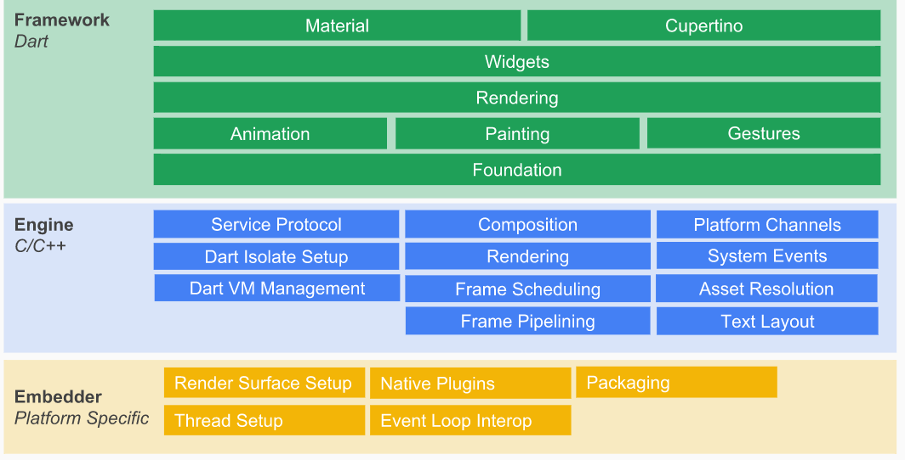

Flutter框架是一个分层的结构，每个层都建立在前一层之上。框架的上层，它比下层的使用频率更高

分层架构使得我们可以在调用Flutter提供的便捷开发功能（预定义的一套高质量Material控件）之外，还可以直接调用甚至修改每一层实现（因为整个框架都属于“用户空间”的代码），这给我们提供了最大程度的自定义能力。Framework底层是Flutter引擎，引擎主要负责图形绘制（Skia）、文字排版（libtxt）和提供Dart运行时，引擎全部使用C++实现，Framework层使我们可以用Dart语言调用引擎的强大能力。

* [Flutter架构图](https://docs.google.com/presentation/d/1cw7A4HbvM_Abv320rVgPVGiUP2msVs7tfGbkgdrTy0I/edit?usp=sharing)
* [Flutter框架概览](https://flutterchina.club/technical-overview/)
https://juejin.im/post/5d177e9a6fb9a07ed36ebfb0
* [Flutter原理与实践](https://tech.meituan.com/2018/08/09/waimai-flutter-practice.html)

* [Flutter技术简介](https://zhuanlan.zhihu.com/p/61613033)

>Flutter Framework：纯Dart实现的SDK
底下两层：底层UI库，提供动画、绘制能力、手势
Rendering层：构建UI树，当UI树有变化的时候，会计算出变化的部分，然后更新UI树，将UI树绘制到屏幕上
Widgets层：提供组件库，提供了Material和Cupertino两种视觉风格的组件库

>Engine层：使用C/C++实现的SDK，主要包括Skia、Dart和Text
Skia：开源的二维图形库，提供了适用于多种软硬件平台的通用API
Dart部分：Dart Runtime，Garbage Collection，如果是debug模式的话，包括JIT(just in time)支持，Release和profile模式下是AOT(ahead of time)编译成了原生的arm代码，不存在JIT部分。
Text：文本渲染，渲染层次如下：衍生自minikin的libtxt库

>Embedder层
Embedder是一个嵌入层，即把Flutter嵌入到各个平台上去，这里做的主要工作包括渲染Surface设置，线程设置，以及插件等。从这里可以看出，Flutter的平台相关性很低，平台只提供一个画布，剩余所有渲染相关的逻辑都在Flutter内部，这就使得它具有很好的跨端一致性。

* [深入理解flutter的编译原理与优化](https://zhuanlan.zhihu.com/p/38839997)
* [京东技术中台的 Flutter 实践之路](https://www.infoq.cn/article/qSLsru9bEvuHgKpPlWMP)