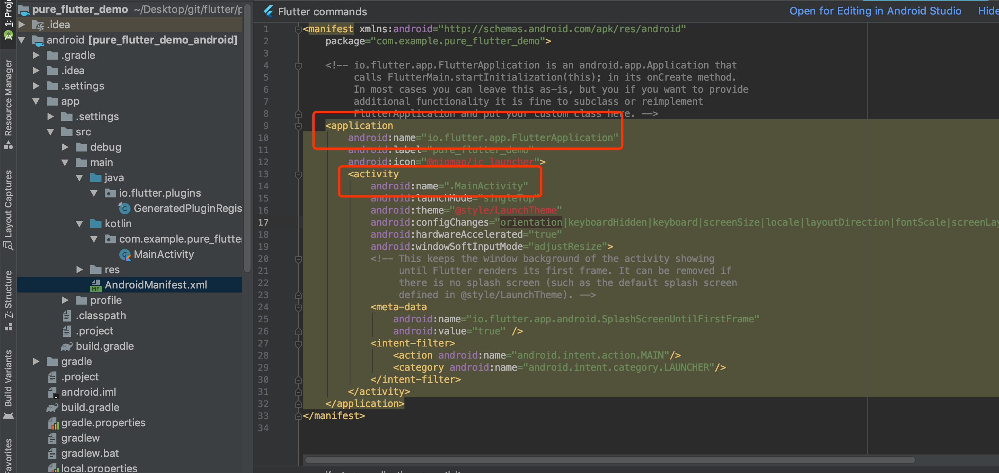
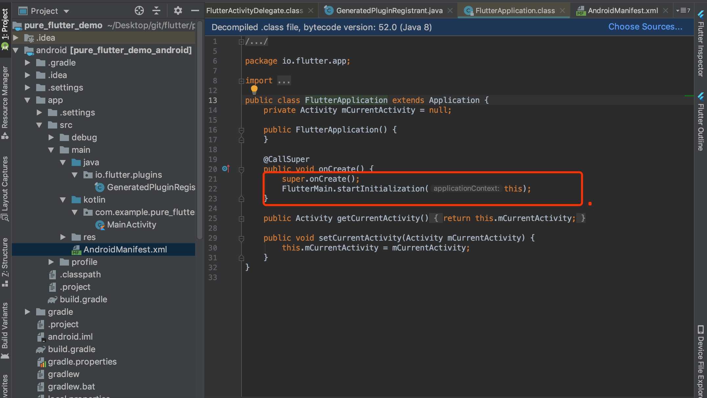
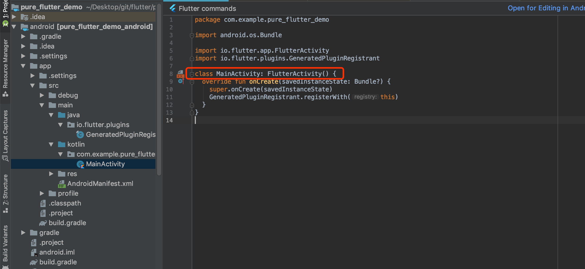

# 1.2 Flutter应用启动过程

## Flutter在安卓平台的启动过程

在android中，一个APP启动会先执行Application再执行Activity(AndroidManifest.xml中配置的启动Activity)

### Flutter项目 AndroidManifest.xml

可以看到整个应用启动时调用FlutterApplication，另外只配置有一个MainActivity；

#### FlutterApplication

可以看到在FlutterApplication的定义中，主要完成了`FlutterMain.startInitialization(this);`的调用

#### MainActivity

MainActivity继承FlutterActivity

## 参考
* [《Flutter实战》14.4 Flutter运行机制-从启动到显示](https://book.flutterchina.club/chapter14/flutter_app_startup.html)
