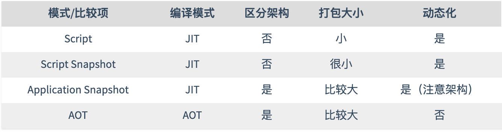
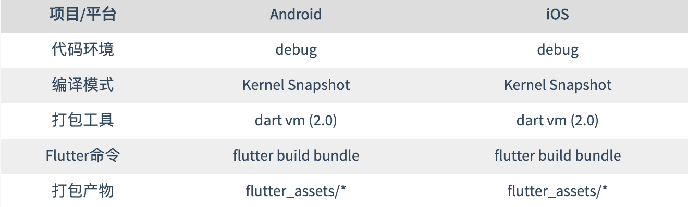
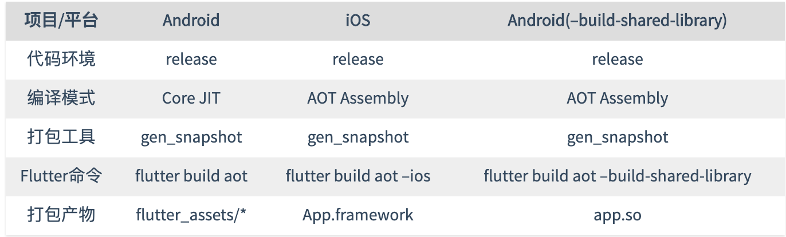

[toc]

# Flutter编译模式

通常来说，编译模式分为两类：JIT 和 AOT。

JIT全称 Just In Time(即时编译），典型的例子就是 v8，它可以即时编译并运行 JavaScript。所以你只需要输入源代码字符串，v8就可以帮你编译并运行代码。

* JIT模式的优势是显而易见的，可以动态下发和执行代码，而不用管用户的机器是什么架构，为应用的用户提供丰富而动态地内容。
* 但 JIT的劣势也是显而易见的，大量字符串的代码很容易让 JIT编译器花费很多时间和内存进行编译，给用户带来的直接感受就是应用启动慢。

AOT全称 Ahead Of Time（事前编译），典型的例子就是 C/C++，LLVM或 GCC通过编译并生成 C/C++的二进制代码，然后这些二进制通过用户安装并取得执行权限后才可以通过进程加载执行。

* AOT的优势也是显而易见的，事先编译好的二进制代码，加载和执行的速度都会非常快。（所以编程语言速度排行榜上前列都是 AOT编译类语言）这样的速度可以在密集计算场景下给用户带来非常好的体验，比如大型游戏的引擎渲染和逻辑执行。

* 但是 AOT的劣势也是显而易见的，编译需要区分用户机器的架构，生成不同架构的二进制代码，除了架构，二进制代码本身也会让用户下载的安装包比较大。二进制代码一般需要取得执行权限才可以执行，所以无法在权限比较严格的系统中进行动态更新（如 iOS）。

## Dart的编译模式

Flutter使用 Dart作为编程语言，自然其编译模式也脱离不了 Dart的干系

Dart所支持的编译模式：

* Script：最普通的 JIT模式，在 PC命令行调用 dart vm执行 dart源代码文件即是这种模式
* Script Snapshot：JIT模式，和上一个不同的是，这里载入的是已经 token化的 dart源代码，提前执行了上一步的 lexer（词法分析）步骤。
* Application Snapshot：JIT模式，这种模式来源于 dart vm直接载入源码后 dump出数据。dart vm通过这种数据启动会更快。不过值得一提的是这种模式是区分架构的，在 x64上生成的数据不可以给 arm使用。
* AOT：AOT模式，直接将 dart源码编译出 .S文件，然后通过汇编器生成对应架构的代码。

## Flutter的编译模式

Flutter 完全采用了 Dart，按道理来说编译模式一致才是，但是事实并不是这样。由于 Android和 iOS平台的生态差异，Flutter也衍生除了非常丰富的编译模式。

* Script：同 Dart Script模式一致，虽然 Flutter支持，但暂未看到使用，毕竟影响启动速度。
* Script Snapshot：同 Dart Script Snapshot一致，同样支持但未使用，Flutter有大量的视图渲染逻辑，纯 JIT模式影响执行速度。
* Kernel Snapshot：Dart的 bytecode 模式，与 Application Snapshot不同，bytecode模式是不区分架构的。 Kernel Snapshot在 Flutter项目内也叫 Core Snapshot。bytecode模式可以归类为 AOT编译。===【存疑】===
* Core JIT：Dart的一种二进制模式，将指令代码和 heap数据打包成文件，然后在 vm和 isolate启动时载入，直接标记内存可执行，可以说这是一种 AOT模式。Core JIT也被叫做 AOTBlob
* AOT Assembly: 即 Dart的 AOT模式。直接生成汇编源代码文件，由各平台自行汇编。

### Flutter开发阶段的编译模式

开发模式下，Flutter使用了 Kernel Snapshot模式编译 （==那岂不是AOT编译，这个说法不对吧？又或者说第一次debug打包debug.apk时使用的这种AOT，然后后续代码修改之后热更新时新的代码使用的是dart源码版JIT模式？==）（按[这里的说法](https://stackoverflow.com/questions/57153618/dart-snapshots-vs-aot)  Kernel Snapshot 应该属于JIT）
在打包产物中，你将发现几样东西：

* isolate_snapshot_data：用于加速 isolate启动，业务无关代码，固定，仅和 flutter engine版本有关
* platform.dill：和 dart vm相关的 kernel代码，仅和 dart版本以及 engine编译版本有关。固定，业务无关代码。
* vm_snapshot_data: 用于加速 dart vm启动的产物，业务无关代码，仅和 flutter engine版本有关
* kernel_blob.bin：业务代码产物

### Flutter生产阶段的编译模式

在生产阶段，应用需要的是非常快的速度，所以 Android和 iOS target毫无意外地都选择了 AOT打包.

## 参考

* [Flutter的编译模式](https://www.stephenw.cc/2018/07/30/flutter-compile-mode/)
* [dart-lang: Snapshots](https://github.com/dart-lang/sdk/wiki/Snapshots)
