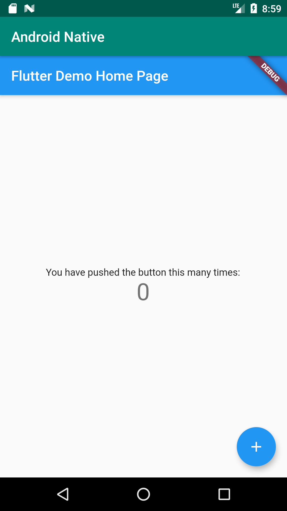

1. FlutterView

```java
    @Override
    protected void onCreate(Bundle savedInstanceState) {
        super.onCreate(savedInstanceState);
//        setContentView(R.layout.activity_main);
        View FlutterView = Flutter.createView(this, getLifecycle(), "defaultRoute"); //传入路由标识符
        setContentView(FlutterView);
    }
```



* [给现有 App 引入 Flutter Module](https://xiejinpeng007.github.io/post/add-flutter-module-to-app/)
  * FlutterEngine 缓存机制


## Adding Flutter to Android （API处于实验性阶段）
* [原生Android集成Flutter混合开发](https://blog.csdn.net/u011060103/article/details/103183631)


  * 通过FlutterActivity类
      * https://github.com/flutter/flutter/wiki/Experimental:-Add-Flutter-Activity
        * 每次创建FlutterActivity时都会创建一个FlutterEngine，而创建FlutterEngine会导致存在冷启动的过程（短暂白屏），为了避免这种情况可以使用FlutterEngineCache提前创建好FlutterEngine并缓存下来
  * 通过FlutterFragment类
    * https://github.com/flutter/flutter/wiki/Experimental:-Add-Flutter-Fragment
    有些app会在一个activity中切换多个Fragment实现切换screens的效果，由于FlutterActivity不能嵌入到Activity中，这种场景下则对应使用FlutterFragment
    * 使用FlutterFragment，会在内部实例化一个FlutterEngine，用于执行Dart代码创建UI，也是存在冷启动的问题，解决方式也是提前创建好FlutterEngine
  * 通过FlutterView类
    * https://github.com/flutter/flutter/wiki/Experimental:-Add-Flutter-View
    * 使用之前优先考虑能否使用FlutterActivity/FlutterFragment实现，以减少开发负担（因为flutterView添加到layout之后，还需要自己调用attachToFlutterEngine和FlutterEngine关联才能开始绘制）
    > A FlutterEngine object is responsible for executing the Dart code in your Flutter app. By default, every FlutterFragment creates a new FlutterEngine internally to run the desired Flutter UI.
* [Flutter学习笔记（30）--Android原生与Flutter混编](https://www.cnblogs.com/upwgh/p/11950392.html)
  * Flutter视图是如何展示到前台界面的
  * 如何进行原生页面跳转到Flutter页面
  * 原生如何与Flutter进行传值通信（以EventChannel为例说明）


* [Flutter混合开发(一)：Android项目集成Flutter模块详细指南](https://zhuanlan.zhihu.com/p/90752829)


##  Launch Flutter with non main entrypoint
* https://github.com/flutter/flutter/wiki/Experimental:-Launch-Flutter-with-non-main-entrypoint

## 包大小影响

原生拉起flutter做的页面以及flutter调用原生模块以及原生模块推送数据到flutter经过验证都是ok的，因此flutter接入现有的app这条路是可行的，接入flutter之后，包大小会激增5.5M+,主要是因为需要用到这个so库，如果能够从网络获取多好，可惜目前只能打包到apk中。在加上业务生成的一些文件，总体上来说，写一个简单的业务，就差不多使得包大小增加了8M左右啦，

作者：brzhang
链接：https://juejin.im/post/5b72a7c46fb9a009ae46c318
来源：掘金
著作权归作者所有。商业转载请联系作者获得授权，非商业转载请注明出处。

* [Flutter启动流程简析](https://juejin.im/post/5cc278a6f265da0378759c87)
* [Flutter Android 端启动流程浅析](https://juejin.im/post/5daac9566fb9a04e1f12fdc1)

## Flutter开发的坑点


## Flutter Platform Channels
* [Flutter Platform Channels](https://medium.com/flutter/flutter-platform-channels-ce7f540a104e)

## Flutter使用现状


## FlutterEngine

A FlutterEngine is responsible for executing Dart code, rendering a Flutter UI to a FlutterView, and connecting plugins to the core Flutter system. Each instance of FlutterEngine comes with a non-trivial "warm-up" time, which sets up a group of dedicated threads and other resources.

Due to the warm-up time of a FlutterEngine instance, developers may choose to cache one or more instances of FlutterEngines and re-use those instances across different Activitys and/or Fragments in their Android app. 

### Ensure Flutter is initialized

Flutter must be initialized before instantiating a single FlutterEngine instance

```java
FlutterMain.startInitialization(...);
FlutterMain.ensureInitializationComplete(...);
```

### Initializing FlutterEngines

A FlutterEngine must go through 2 steps to be fully initialized. First, an instance is instantiated. Second, the FlutterEngine is instructed to execute a Dart entrypoint, e.g., main().

```java
// Instantiate a FlutterEngine.
FlutterEngine engine = new FlutterEngine(appContext);

// Define a DartEntrypoint
DartExecutor.DartEntrypoint entrypoint = new DartExecutor.createDefault();

// Execute the DartEntrypoint within the FlutterEngine.
engine.getDartExecutor().executeDartEntrypoint(entrypoint);
```

### Dart entrypoint restrictions
A FlutterEngine can only execute a Dart entrypoint one time. Once a FlutterEngine has started executing Dart code, it will continue to execute that Dart code until the FlutterEngine is disposed. To re-use a FlutterEngine that needs to display different experiences at different times you will need to find an approach that accomplishes your goals without restarting Dart execution.

1. Using a Navigator with routes (Native端操作FlutterEngine进行路由跳转)

```java
myFlutterEngine.getNavigationChannel().pushRoute("myPage");
```

2. Using method channels and a custom widget （Native端通过method channels发送消息，Flutter端接收到消息之后切换到对应路由组件）


### 重用FlutterEngine的问题

如果某个Activity使用FlutterEngineA，调起一个Native弹窗，弹窗内是一个Fragment使用的也是FlutterEngineA，由于一个FlutterEngine在一个时刻只能渲染一个UI，这种场景下可能就需要缓存两个FlutterEngine而不是一个才能解决问题。


## 市面上应用的例子

* 闲鱼10多个页面
* 美团外卖全品类页面
* 腾讯now直播

## 实践

* 源码依赖的模式下直接打开安卓项目，然后修改flutter模块代码并不会触发热更新，需要在flutter模块下启动flutter项目才能触发热更新


## 分享参考

* [Flutter 跨平台开发框架-腾讯now直播](https://myslide.cn/slides/11161#) （性能对比数据来源）
* [Flutter 跨平台演进及架构开篇](http://gityuan.com/flutter/)
