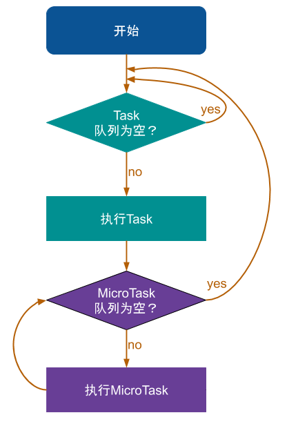

# Dart

## dart 特点

* 支持JIT & AOT 模式, 开发环境时使用JIT, 无需等待编译，还能热重载，提升开发效率，生产环境时使用AOT,提前编译，执行速度快; 两者兼具
* 异常灵活，还能编译成JS，使得Flutter-web也成为可能（一套代码，同时产出native app 和 web app）
* 兼具动态语言，静态语言的特征，易学
* 开源

* [Why Flutter Uses Dart](https://hackernoon.com/why-flutter-uses-dart-dd635a054ebf)
  * 多线程语言容易出现Race condition问题（同时操作公共资源比如内存时），引出锁/死锁的问题，dart中的线程（又称为isolates）不共享内存，避免了绝大多数需要加锁的问题
    > Threads in Dart, called isolates, do not share memory, which avoids the need for most locks
  * dart是单线程的，可以确保动画的执行不被抢占；
  * 当然如果开发者占用线程太长时间会阻塞其他代码，但是相比race condition这种情况更容易发现和修复。当需要进行大量计算时使用[Isolate.spawn()](https://api.dartlang.org/stable/2.6.1/dart-isolate/Isolate/spawn.html)或[Flutter’s compute() function](https://flutter.dev/docs/cookbook/networking/background-parsing#4-move-this-work-to-a-separate-isolate)开启单独的线程


## 异步编程


单线程语言，事件循环


dart的消息队列有两个： Event Queue 和 Microtask Queue

event queue：包括IO、鼠标事件、绘制事件、定时器、dart isolate之间的消息等等；Futter添加的异步任务都就是向event queue里添加。

microtask：可以理解为拦截器，优先级比event queue要高。 即microtask里的任务必须执行完后，才能执行event queue。


### Future

打开future.dart可以看到Future抽象类依赖Timer抽象类， 而Timer抽象类又依赖Zone抽象类(zone.dart)。 Future是对Timer类的封装， 而Timer类又是对Zone类的封装。
Futter添加的异步任务都就是向event queue里添加。

```dart
factory Future(FutureOr<T> computation()) {
    _Future<T> result = new _Future<T>();
    Timer.run(() {
      try {
        result._complete(computation());
      } catch (e, s) {
        _completeWithErrorCallback(result, e, s);
      }
    });
    return result;
  }

```

例子
```dart
void main() {
  print("this is dart entrance");
 
  Future future1 = new Future(() => null);
  future1.then((_) {
    print("future1 then");
  }).catchError((e) {
    print("future1 catchError");
  }).whenComplete(() {
    print("future1 whenComplete");
  });
 
  Future future2 = new Future((){
    print("future2 init");
  });
 
  future2.then((_) {
    print("future2 then");
    future1.then((_){
      print("future1 excute by future2");
    });
  }).catchError((e) {
    print("future2 catchError");
  }).whenComplete(() {
    print("future2 whenComplete");
  });
 
  future1.then((_) {
    print("future1 reexecute");
  });
 
  Future future3 = new Future((){
    print("future3 init");
  });
  print("this is dart end");
 
}

/*
运行结果：

this is dart entrance
this is dart end
future1 then
future1 whenComplete
future1 reexecute
future2 init
future2 then
future2 whenComplete
future1 excute by future2
future3 init
*/
```
dart中的Future和JS中的Promise还是有些细微的差别的

* [Dart asynchronous programming: Isolates and event loops](https://medium.com/dartlang/dart-asynchronous-programming-isolates-and-event-loops-bffc3e296a6a)


### Event loop

All of the high-level APIs and language features that Dart has for asynchronous programming — futures, streams, async and await — they’re all built on and around this simple Event loop.
