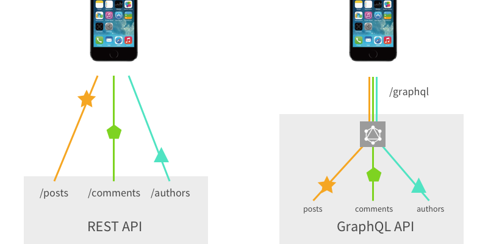
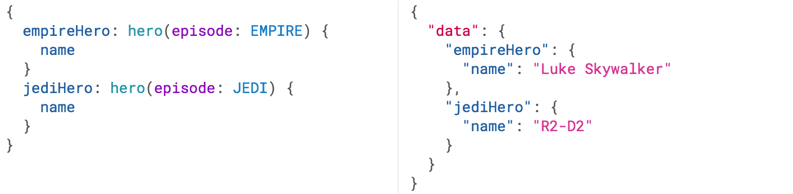

[toc]

# graphql入门

## 基本介绍
以往的restful API基于uri把相应的资源对应起来供客户端消费，每次新增需要就需要新增api，另外api太多，以及api可能还需要维护多个版本，管理起来比较麻烦。graphql 另辟蹊径，将所有的资源比作一个数据库，通过graphql进行查询及其他操作，使得客户端可以按需组合自己想要的资源，灵活方便。


### 卖点

## graphql语言

### 查询和变更
#### 查询


查询和其结果拥有几乎一样的结构，你总是能得到你想要的数据

#### 带参数查询


#### 赋予查询结果别名 （为了避免结果字段冲突）


#### 片段（复用重复的单元）


#### 操作名称
这之前，我们都使用了简写句法，省略了 query 关键字和查询名称，但是生产中使用这些可以使我们代码减少歧义。


这里`query`是“操作类型”， HeroNameAndFriends 是“操作名称”
操作类型：描述你打算做什么类型的操作。操作类型是必需的，除非你使用查询简写语法。

操作类型包括：
* query
* mutation
* subscription

#### 变量
有时需要动态查询一个资源，这时需要查询能够带上相应的变量
你可以通过拼接字符串的形式把变量拼接进query语句中，但是这样做比较麻烦，并不推荐，而是使用专用的分离的变量字典
使用变量之前，我们得做三件事：
1. 使用 $variableName 替代查询中的静态值
2. 声明 $variableName 为查询接受的变量之一
3. 将 variableName: value 通过传输专用（通常是 JSON）的分离的变量字典中


##### 变量定义
变量定义看上去像是上述查询中的 (`$episode: Episode`)。其工作方式跟类型语言中函数的参数定义一样。它以列出所有变量，变量前缀必须为 `$`，后跟其类型

所有声明的变量都必须是标量、枚举型或者输入对象类型

##### 变量默认值


#### 指令
变量使得我们可以避免手动字符串插值构建动态查询，而通过指令可以动态地改变我们查询的结构


一个指令可以附着在字段或者片段包含的字段上，然后以任何服务端期待的方式来改变查询的执行。GraphQL 的核心规范包含两个指令:
* `@include(if: Boolean)` 仅在参数为 `true` 时，包含此字段
* `@skip(if: Boolean)` 如果参数为 `true`，跳过此字段

服务端实现也可以定义新的指令来添加新的特性

#### 变更
查询只能完成资源的获取，而变更则是完成资源的创建、更新、删除等操作


除了操作类型，结构上同查询完全相似。另外还有个重要区别：
**查询字段时，是并行执行，而变更字段时，是线性执行，一个接着一个**
这意味着如果我们一个请求中发送了两个 incrementCredits 变更，第一个保证在第二个之前执行，以确保我们不会出现竞态

#### 内联片段
如果你查询的字段返回的是接口或者联合类型，那么你可能需要使用内联片段来取出下层具体类型的数据：


#### 元字段
GraphQL 允许你在查询的任何位置请求 __typename，一个元字段，以获得那个位置的对象类型名称

GraphQL 服务提供了不少元字段，剩下的部分用于描述 **内省** 系统

前面的查询和变更都是讲客户端怎么做；
下面讲“Schema 和类型”则是服务端需要怎么做

### Schema 和类型
每一个 GraphQL 服务都会定义一套类型，用以描述你可能从那个服务查询到的数据。每当查询到来，服务器就会根据 schema 验证并执行查询

一个 GraphQL schema 中的最基本的组件是**对象类型**，它就表示你可以从服务上获取到什么类型的对象，以及这个对象有什么字段。

* `Character` 是一个 GraphQL 对象类型，表示其是一个拥有一些字段的类型。
* `name` 和 `appearsIn` 是 Character 类型上的字段。这意味着在一个操作 Character 类型的 GraphQL 查询中的任何部分，都只能出现 name 和 appearsIn 字段
* `String` 是内置的标量类型之一 —— 标量类型是解析到单个标量对象的类型，无法在查询中对它进行次级选择。
* `String!` 表示这个字段是非空的，GraphQL 服务保证当你查询这个字段后总会给你返回一个值。在类型语言里面，我们用一个感叹号来表示这个特性
* `[Episode!]!` 表示一个 Episode 数组。因为它也是非空的，所以当你查询 appearsIn 字段的时候，你也总能得到一个数组（零个或者多个元素）。且由于 Episode! 也是非空的，你总是可以预期到数组中的每个项目都是一个 Episode 对象

#### 参数（Arguments）
GraphQL 对象类型上的每一个字段都可能有零个或者多个参数


#### 查询和变更类型
你的 schema 中大部分的类型都是普通对象类型，但是一个 schema 内有两个特殊类型,它们之所以特殊，是因为它们定义了每一个 GraphQL 查询的**入口**


#### 标量类型
标量类型表示对应 GraphQL 查询的叶子节点, 它们没有任何次级字段
GraphQL 自带一组默认标量类型：
* Int：有符号 32 位整数。
* Float：有符号双精度浮点值。
* String：UTF‐8 字符序列。
* Boolean：true 或者 false。
* ID：ID 标量类型表示一个唯一标识符，通常用以重新获取对象或者作为缓存中的键。ID 类型使用和 String 一样的方式序列化；然而将其定义为 ID 意味着并不需要人类可读型。

##### 自定义标量类型
大部分的 GraphQL 服务实现中，都有自定义标量类型的方式,例如，我们可以定义一个 Date 类型：
```
scalar Date
```
然后就取决于我们的实现中如何定义将其序列化、反序列化和验证

#### 枚举类型
枚举类型是一种特殊的标量，它限制在一个特殊的可选值集合内
```
enum Episode {
  NEWHOPE
  EMPIRE
  JEDI
}
```

#### 列表和非空
```
type Character {
  name: String!
  appearsIn: [Episode]!
}
```
通过在类型名后面添加一个感叹号`!`将其标注为**非空**

非空类型修饰符也可以用于定义字段上的参数
```
query DroidById($id: ID!) {
  droid(id: $id) {
    name
  }
}
```

在 GraphQL schema 语言中，我们通过将类型包在方括号（`[` 和 `]`）中的方式来标记列表


非空和列表修饰符可以组合使用
`myField: [String!]` 表示数组本身可以为空，但是其不能有任何空值成员
```
myField: null // 有效
myField: [] // 有效
myField: ['a', 'b'] // 有效
myField: ['a', null, 'b'] // 错误
```
`myField: [String]!` 表示数组本身不能为空，但是其可以包含空值成员
```
myField: null // 错误
myField: [] // 有效
myField: ['a', 'b'] // 有效
myField: ['a', null, 'b'] // 有效
```

#### 接口
接口是一个抽象类型，它指明需要包含某些特定的字段
```
interface Character {
  id: ID!
  name: String!
  friends: [Character]
  appearsIn: [Episode]!
}

type Human implements Character {
  id: ID!
  name: String!
  friends: [Character]
  appearsIn: [Episode]!
  starships: [Starship]
  totalCredits: Int
}
```
当你要返回一个对象或者一组对象，特别是一组不同的类型时，接口就显得特别有用

#### 联合类型
联合类型和接口十分相似，但是它并不指定类型之间的任何共同字段, 而是指定可以是这些种类型中的一个
```
union SearchResult = Human | Droid | Starship
```
注意，联合类型的成员需要是具体对象类型；你不能使用接口或者其他联合类型来创造一个联合类型
如果你需要查询一个返回 SearchResult 联合类型的字段，那么你得使用条件片段才能查询任意字段


#### 输入类型
有时候你需要传递一整个对象作为新建对象,这时需要定义输入类型
```
input ReviewInput {
  stars: Int!
  commentary: String
}
```


### 执行过程
一个graphql查询过程：

客户端构造查询请求 ---> 发起请求 ---> graphql服务端收到请求 ---> 解析并校验查询语句 ---> 执行查询语句 ---> 返回结果

type schema
```js
type Query {
  human(id: ID!): Human
}

type Human {
  name: String
  appearsIn: [Episode]
  starships: [Starship]
}

enum Episode {
  NEWHOPE
  EMPIRE
  JEDI
}

type Starship {
  name: String
}
```
查询语句
```
{
  human(id: 1002) {
    name
    appearsIn
    starships {
      name
    }
  }
}
```
你可以将 GraphQL 查询中的每个字段视为返回子类型的父类型函数或方法。事实上，这正是 GraphQL 的工作原理。每个类型的每个字段都由一个 resolver 函数支持，该函数由 GraphQL 服务器开发人员提供。当一个字段被执行时，相应的 resolver 被调用以产生下一个值。

如果字段产生标量值，例如字符串或数字，则执行完成。如果一个字段产生一个对象，则该查询将继续执行该对象对应字段的解析器，直到生成标量值。GraphQL 查询始终以标量值结束。

#### 异步解析器 
```
human(obj, args, context, info) {
  return context.db.loadHumanByID(args.id).then(
    userData => new Human(userData)
  )
}

```

通过context.db.loadHumanByID 从数据库拉取数据的过程是一个异步操作，该方法返回了一个 Promise 对象

要注意的是，只有解析器能感知到 Promise 的进度，GraphQL 查询只关注一个包含着 name 属性的 human 字段是否返回，在执行期间如果异步操作没有完成，则 GraphQL 会一直等待下去，因此在这个环节需要关注异步处理上的优化

#### 列表解析器
```
Human: {
  starships(obj, args, context, info) {
    return obj.starshipIDs.map(
      id => context.db.loadStarshipByID(id).then(
        shipData => new Starship(shipData)
      )
    )
  }
}
```
解析器在这个字段中不仅仅是返回了一个 Promise 对象，它返回一个 Promises 列表

### 内省
我们有时候会需要去问 GraphQL Schema 它支持哪些查询。GraphQL 通过内省系统让我们可以做到这点

比如如果类型不是我们设计的，我们可以通过查询 __schema 字段来向 GraphQL 询问哪些类型是可用的


## 实践

### 单入口http请求
GraphQL 通常通过单入口来提供 HTTP 服务的完整功能，这一实现方式与暴露一组 URL 且每个 URL 只暴露一个资源的 REST API 不同。虽然 GraphQL 也可以暴露多个资源 URL 来使用，但这可能导致您在使用 GraphiQL 等工具时遇到困难

你的 GraphQL HTTP 服务器应当能够处理 HTTP GET 和 POST 方法

#### GET 请求
```
{
  me {
    name
  }
}
```
```
http://myapi/graphql?query={me{name}}
```
#### POST 请求
标准的 GraphQL POST 请求应当使用 application/json 内容类型（content type），并包含以下形式 JSON 编码的请求体：
```
{
  "query": "...",
  "operationName": "...",
  "variables": { "myVariable": "someValue", ... }
}
```
#### 响应
无论使用任何方法发送查询和变量，响应都应当以 JSON 格式在请求正文中返回
查询结果可能会是一些数据和一些错误，并且应当用以下形式的 JSON 对象返回：
```
{
  "data": { ... },
  "errors": [ ... ]
}
```

### 版本控制

虽然没有什么可以阻止 GraphQL 服务像任何其他 REST API 一样进行版本控制，但 GraphQL 强烈认为可以通过 GraphQL schema 的持续演进来避免版本控制

为什么大多数 API 有版本？当某个 API 入口能够返回的数据被限制，则任何更改都可以被视为一个破坏性变更，而破坏性变更需要发布一个新的版本。如果向 API 添加新功能需要新版本，那么在经常发布版本并拥有许多增量版本与保证 API 的可理解性和可维护性之间就需要权衡。

相比之下，GraphQL 只返回显式请求的数据，因此可以通过增加新类型和基于这些新类型的新字段添加新功能，而不会造成破坏性变更。这样可以衍生出始终避免破坏性变更并提供无版本 API 的通用做法。

### 授权
不推荐在GraphQL层中放置授权逻辑，应当在 业务逻辑层 实施这种行为。
在GraphQL层中放置授权逻辑的问题是我们需要复制逻辑到服务中的每一个入口端点


GraphQL 层中放置授权逻辑的例子：
```
var postType = new GraphQLObjectType({
  name: 'Post',
  fields: {
    body: {
      type: GraphQLString,
      resolve: (post, args, context, { rootValue }) => {
        // 只有当用户是帖子的作者时才返回帖子正文
        if (context.user && (context.user.id === post.authorId)) {
          return post.body;
        }
        return null;
      }
    }
  }
});
```
在业务逻辑层处理授权的例子
```
// 授权逻辑在 postRepository 中
var postRepository = require('postRepository');

var postType = new GraphQLObjectType({
  name: 'Post',
  fields: {
    body: {
      type: GraphQLString,
      resolve: (post, args, context, { rootValue }) => {
        return postRepository.getBody(context.user, post);
      }
    }
  }
});
```
>其实就是把授权逻辑和resolver逻辑拆分开

### 分页
分页的方式有很多，比如：
* 我们可以像这样 friends(first:2 offset:2) 来请求列表中接下来的两个结果
* 我们可以像这样 friends(first:2 after:$friendId), 来请求我们上一次获取到的最后一个朋友之后的两个结果
* 我们可以像这样 friends(first:2 after:$friendCursor), 从最后一项中获取一个游标并使用它来分页
* 甚至我们可以暴露更多的分页信息
```
{
  hero {
    name
    friends(first:2) {
      totalCount
      edges {
        node {
          name
        }
        cursor
      }
      pageInfo {
        endCursor
        hasNextPage
      }
    }
  }
}
```
#### 分页获取数据demo
```JS
// use vue-apollo
  apollo: {
    Articles: {
      query: gql`query getArticles($input: PageInfo){
        Articles(pageinfo: $input) {
          title
          id
          description
        }
      }`,
      variables: {
        input: {
          limit: 6,
          offset: 0
        }
      },
      fetchPolicy: 'network-only'
    },
  },
  methods: {
    loadingMore() {
      this.$apollo.queries.Articles.fetchMore({
        variables: { // 更新新的variables
          input: {
            limit: 6,
            offset: this.Articles.length
          }
        },
        updateQuery: (previousResult, { fetchMoreResult }) => {
          const newArticles = fetchMoreResult.Articles
          if (newArticles.length === 0) {
            alert('no more data')
          }
          return {
            Articles: [...previousResult.Articles, ...newArticles] // 更新新数据
          }
        }
      })
    }
  }

```
## 参考
* [官网 GraphQL 入门](http://graphql.cn/learn/)
* [Authentication and Authorization in GraphQL (and how GraphQL-Modules can help)](https://medium.com/the-guild/authentication-and-authorization-in-graphql-and-how-graphql-modules-can-help-fadc1ee5b0c2)