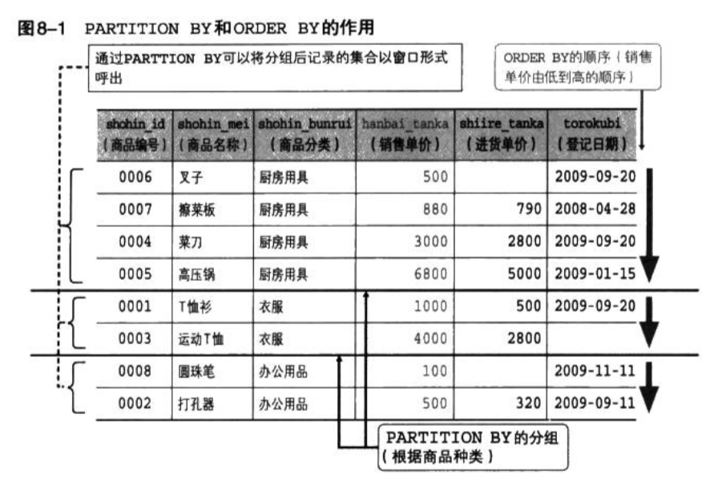

[toc]

# 2.《SQL基础教程》笔记

## 第一章SQL概要

* SQL语句要以分号`;`结尾；
* SQL语句不区分大小写；
  * 例如，不管写成SELECT还是select，解释都是一样的；
  * 但是为了理解方便，通常使用以下规则书写
    * 关键字大写；
    * 表名的首个字大写；
    * 其余（列名等）小写；
  * 插入到表中的数据是区分大小写的；
* SQL语句中字符串和日期常数需要使用单引号`'`将其括起来，数字常数则不需要；
* SQL语句的单词之间使用半角空格或换行符来进行分隔；

### 表的创建

* 创建数据库`CREATE DATABASE <数据库名称>`
* 数据库名称、表名、列名都要使用半角字符（半角英文字符、半角数字、下划线`_`）,且以英文字母开头；
* 一个数据库不能存在相同名称的表名，一个表中不能存在相同名称的列

#### 创建表

```
CREATE TABLE <表名>
(
  <列名1> <数据类型> <该列所需约束>,
  <列名2> <数据类型> <该列所需约束>,
  <列名3> <数据类型> <该列所需约束>,
  ...
<该表的约束1>, <该表的约束2>);
```
比如
```
CREATE TABLE Shohin
(
  shohin_id    CHAR(4)         NOT NULL,
  shohin_mei   VARCHAR(100)    NOT NULL,
  torokubi     DATE            ,
  PRIMARY KEY (shohin_id));
```

#### 数据类型的指定

数据类型的种类很多，各个RDBMS之间也存在差异，下面介绍4中基本的数据类型：

* INTEGER型：存整数类型；
* CHAR型：存字符串类型，可以像CHAR(10)或者CHAR(200)这样，在括号中指定字符串的最大长度，超出部分无法存入数据库；
  * 字符串以定长字符串的形式存储在对应的列中，达不到最大长度时会使用半角空格进行补充；
* VARCHAR型：同CHAR型类似，差别是长度可变，不足最大长度时不会使用半角空格补充；
* DATE型：用来指定存储日期型的数据；

#### 约束的设置

* NOT NULL

### 表的删除和更新

#### 表的删除

```
DROP TABLE <表名>;
```

#### 表的更新

##### 添加列
```
ALTER TABLE <表名> ADD COLUMN <列的定义>
```

##### 删除列
```
ALTER TABLE <表名> DROP COLUMN <列名>;
```
##### 向表中插入数据


## 第二章 查询基础

### 列的查询

```
SELECT <列名>,......
  FROM <表名>;
```

#### 查询出表中的所有列

```
SELECT *
  FROM <表名>;
```

#### 使用AS关键字为列设定别名

```
SELECT shohin_id AS id,
       shohin_mei AS name,
  FROM Shohin;
```
别名可以使用汉语名，但是需要使用双引号`"`将汉语括起来；

#### 常数的查询

SELECT子句不仅可以书写列名，还可以书写常数。
```
SELECT '商品' AS mojiretsu, 38 AS kazu, '2009-02-24' AS hizuke, shohin_id, shohin_mei
  FROM Shohin;
```

#### 使用DISTINCT从结果中删除重复的行

```
SELECT DISTINCT shohin_bunrui
  FROM Shohin;
```

#### 根据WHERE语句来选择记录

```
SELECT <列名>,...
  FROM <表名>
  WHERE <条件表达式>;
```

```
SELECT shohin_id, shohin_mei
  FROM Shohin
  WHERE shohin_bunrui = '衣服';
```

* WHERE子句要紧跟在FROM子句之后；

#### 注释的写法

* 单行注释：书写在`--`之后,只能写在同一行；
* 多行注释：书写在`/*`和`*/`之间，可以跨多行；
```
-- 这是单行注释，不影响SQL语句功能
/*
  这是多行注释，不影响SQL语句功能
*/
```

### 算术运算符和比较运算符

* 使用算术运算符可以进行四则运算；
* 括号可以提升运算的优先顺序；
* 包含NULL的运算，其结果也是NULL;
* 比较运算符可以用来判断列或值是否相等，还可以用来比较大小；
* 判断是否为NULL，需要使用`IS NULL`或者 `IS NOT NULL`;

#### 算术运算符

算术运算符：加减乘除，括弧提升运算优先级

```
SELECT shohin_mei, hanbai_tanka,
  hanbai_tanka * 2 AS "hanbai_tanka_x2"
FROM Shohin;
```

#### 比较运算符

```
SELECT shohin_mei, shohin_bunrui
  FROM Shohin
  WHERE hanbai_tanka = 500;
```

* `=` 等于
* `<>` 不等于
* `>=` 大于等于
* `>` 大于
* `<=` 小于等于
* `<` 小于

这些比较运算符可以对字符、数字和日期等几乎所有的数据类型的列和值进行比较

```
SELECT shohin_mei, shohin_bunrui
  FROM Shohin
  WHERE torokubi < '2009-09-27';
```
小于某个日期就是在该日期之前的意思；

注意：

* 对字符串进行大小比较时，比较的是字典顺序 （和JS中字符串比较类似）；
* 不能对NULL使用比较运算符，需要使用`IS NULL`或者`IS NOT NULL`；

### 逻辑运算符：与或非

#### NOT运算符

```
SELECT shohin_mei, shohin_bunrui
  FROM Shohin
  WHERE NOT hanbai_tanka >= 1000; 
```
#### AND运算符和OR运算符

```
SELECT shohin_mei, shohin_bunrui
  FROM Shohin
  WHERE shohin_bunrui = '厨房用具'
    AND hanbai_tanka >= 1000; 
```

```
SELECT shohin_mei, shohin_bunrui
  FROM Shohin
  WHERE shohin_bunrui = '厨房用具'
    OR hanbai_tanka >= 1000; 
```

注意：
* 可以通过括弧明确运算的优先级；
* SQL只能够存在三值逻辑：真、假、UNKNOWN（对应NULL的真值）；
* 考虑到值为NULL的时候条件判断会变得异常复杂，通常的共识是尽量不使用NULL(创建表时使用NOT NULL约束);

## 第三章 聚合与排序

* 使用聚合函数进行合计值或者平均值等合计操作；
* 通常聚合函数对NULL以外的对象进行合计。但是只有COUNT函数例外；
* 使用DISTINCT关键字删除重复值；

### 聚合函数

常用的聚合函数：
* COUNT: 计算表中的记录数（行数）；
* SUM: 计算表中列的数据合计值；
* AVG: 计算列的数据平均值；
* MAX: 计算列的数据的最大值；
* MIN: 计算列的数据的最小值；

#### 计算表中数据的行数

计算所有的行数 COUNT(*)
```
SELECT COUNT(*)
  FROM Shohin;
```

计算NULL之外的数据行数 COUNT(<列名>)
```
SELECT COUNT(shiire_tanka)
  FROM Shohin;
```

#### 计算合计值

```
SELECT SUM(shiire_tanka)
  FROM Shohin;
```

注意：
* 除COUNT(*)外，聚合函数会将NULL排除在外，所以是可以正常运算的；

#### 计算平均值

```
SELECT AVG(shiire_tanka), AVG(shiire_tanka)
  FROM Shohin;
```

#### 计算最大值和最小值

```
SELECT MAX(shiire_tanka), MIN(shiire_tanka)
  FROM Shohin;
```
注意：
* SUM/AVG 只能对数值类型的列使用，MAX/MIN可以适用于任何数据类型的列；

#### 使用聚合函数删除重复值 DISTINCT

```
SELECT COUNT(DISTINCT shiire_tanka)
  FROM Shohin;
```

注意：
* DISTINCT 适用于所有聚合函数

```
SELECT SUM(DISTINCT shiire_tanka)
  FROM Shohin;
```

### 对表进行分组

#### GROUP BY子句

```
SELECT shohin_bunrui, COUNT(*)
  FROM Shohin
  GROUP BY shohin_bunrui;
```
注意：
* GROUP BY一定要写在FROM语句之后（如果有WHERE语句则写在WHERE子句之后）；
* GROUP BY不能使用列的别名；
* GROUP BY时使用聚合键之外的列名会导致报错；
* 通常GROUP BY的结果的排列顺序是随机的；后面再介绍如何对结果排序；

#### 聚合键中包含NULL的情况

当聚合键中包含NULL时，会将NULL作为一组特定的数据；

### 为聚合结果指定条件

* 使用COUNT函数等对表中数据进行聚合操作时，为其指定条件的不是WHERE子句，而需要使用HAVING子句。
* 聚合函数可以在SELECT子句、HAVING子句和ORDER BY子句中使用；
* HAVING子句要写在GROUP BY子句之后。
* WHERE子句用来指定数据行的条件，HAVING子句用来指定分组的条件。

```
SELECT <列名1>, <列名2>,.....
  FROM <表名>
  GROUP BY <列名1>, <列名2>,.....
HAVING <分组结果对应的条件>
```

```
SELECT shohin_bunrui, COUNT(*)
  FROM Shohin
  GROUP BY shohin_bunrui
HAVING COUNT(*) = 2;
```

#### HAVING子句的构成要素

HAVING子句中能够使用的3种要素如下：
* 常数；
* 聚合函数；
* GROUP by子句中指定的列名（即聚合键）；

（把GROUP BY聚合的结果作为一个临时表，然后HAVING以该临时表为起点，更容易理解）

注意：
* 为了得到相同的结果，WHERE子句要比HAVING子句的处理速度更快，所以能写WHERE子句就写WHERE子句；

#### 对查询结果进行排序

* 使用ORDER BY子句对查询结果进行排序；
* 使用ASC关键字进行升序排序，使用DESC关键字进行降序排序；
* ORDER BY可以指定多个排序键；
* 排序键中包含NULL时，会在开头或者末尾进行汇总；
* ORDER BY子句中可以使用SELECT子句中定义的列的别名；
* ORDER BY子句中可以使用SELECT子句中未出现的列或者聚合函数；
* ORDER BY子句不能使用列的编号；

通常从表中抽取数据时，如果没有特别指定顺序，最终排列顺序便无从得知。即使是同一条SELECT语句，每次执行的排列顺序很可能是不一样的。通过ORDER BY可以指定排列顺序。

```
SELECT <列名1>, <列名2>,...
  FROM <表名>;
ORDER BY <排序基准列1>,<排序基准列2>
```
```
SELECT shohin_mei, shohin_bunrui, shohin_tanka
  FROM Shohin
  ORDER BY shohin_tanka;
```

注意：
* 不论何种情况，ORDER BY子句都必须写在SELECT语句的末尾。

##### 指定多个排序键

指定多个排序键的作用在于，对于前面的排序键的值相同的行，该如何进一步排序。

##### NULL的排序

由于不能对NULL值进行比较运算，所以含有NULL的列作为排序键时，NULL会在结果的开头或者末尾汇总。对于是在开头还是在末尾，没有特殊的规定，某些DBMS中可以指定NULL在开头或者末尾显示。

##### 排序键中使用显示用别名

排序键中使用列的别名

使用HAVING子句是SELECT语句的执行顺序：
FROM -> WHERE -> GROUP BY -> HAVING -> SELECT -> ORDER BY

SELECT子句在GROUP BY 子句之后，ORDER BY子句之前，所以在GROUP BY子句中不能使用SELECT中定义的别名，而ORDER BY子句中则可以使用列的别名；

##### ORDER BY子句中可以使用的列

* ORDER BY子句中可以使用存在于表，但是不包含在SELECT子句之中的列。
* ORDER BY子句还可以使用聚合函数；
```
SELECT shohin_mei, shohin_bunrui, shohin_tanka
  FROM Shohin
  ORDER BY shohin_id;
```

```
SELECT shohin_bunrui, COUNT(*)
  FROM Shohin
  GROUP BY shohin_bunrui
  ORDER BY COUNT(*);
```

##### 不要使用列编号

列编号是指SELECT子句中的列从左到右排时对应的编号（1，2，3...）

```
SELECT shohin_id, shohin_mei, shohin_tanka, shiire_tanka
  FROM Shohin
  ORDER BY shohin_tanka DESC, shohin_id
```

等价于

```
SELECT shohin_id, shohin_mei, shohin_tanka, shiire_tanka
  FROM Shohin
  ORDER BY 3 DESC, 1
```
> shohin_tanka在`shohin_id, shohin_mei, shohin_tanka, shiire_tanka`中从左到右排在第3位

虽然可以使用列编号，但是并不推荐使用，原因如下：
* 代码阅读困难；
* SQL-92中明确支持列编号这种排序功能将来会被删除；

## 第四章 数据更新

### 数据的插入 INSERT

#### INSERT语句的基本语法

```
INSERT INTO <表名>(列1, 列2, 列3, ...) VALUES (值1,值2,值3,...);
```

括弧括起来的叫做”清单“，上面包含一个列清单和一个值清单。
```
INSERT INTO ShohinIns (shohin_id, shohin_mei, shohin_bunrui, hanbai_tanka, shiire_tanka, torokubi) VALUES ('0001', 'T恤衫', '衣服', 1000, 500, '2009-09-20');
```

* 原则上执行一次INSERT语句会插入一行数据，因此，插入多行时，通常需要循环执行所需行数次的INSERT语句。
* 但是很多RMDBS都支持一次INSERT多行数据；（不适用于Oracle）
```
INSERT INTO ShohinIns VALUES
  ('0002', '打孔器', '办公用品', 500, 320, '2009-09-11'),
  ('0003', '菜刀', '厨房用品', 3000, 2800, '2009-09-11');
```

#### 列清单的省略

可以省略INSERT语句中的列清单，这是VALUES子句中的值会默认从左到右的顺序赋给每一列。

#### 插入NULL
INSERT语句中想给某一列赋值NULL时，直接在值清单中写入NULL即可
```
INSERT INTO ShohinIns (shohin_id, shohin_mei, shohin_bunrui, hanbai_tanka, shiire_tanka, torokubi) VALUES ('0007', '菜刀', '厨房用具', DEFAULT, 790, '2008-04-28');
```

#### 插入默认值

默认值的设定是通过创建表时在CREATE TABLE语句中设置DEFAULT约束来实现的。

默认值的使用方法分为显示和隐示。

显示：
```
INSERT INTO ShohinIns (shohin_id, shohin_mei, shohin_bunrui, hanbai_tanka, shiire_tanka, torokubi) VALUES ('0001', 'T恤衫', '衣服', 1000, 500, '2009-09-20');
```

隐示：(省略hanbai_tanka列和值)
```
INSERT INTO ShohinIns (shohin_id, shohin_mei, shohin_bunrui, shiire_tanka, torokubi) VALUES ('0001', 'T恤衫', '衣服', 500, '2009-09-20');
```
省略列名时，如果该列没有指定默认值，则会写入NULL值

建议使用显示方法，语义更加明确。

#### 从其他表中复制数据

```
INSERT INTO <表2名> (<列名1>,...)
  SELECT <列名1>,...
  FROM <表1名>
```

* INSERT语句的SELECT子句中，可以使用WHERE子句或者GROUP BY子句等任何SQL语法；

### 数据的删除

* 将整个表删除，可以使用DROP TABLE，如果只是删除表中的数据，则使用DELETE语句；
* 如果只是删除部分数据行，只需在WHERE子句中书写对象数据的条件即可；

#### DELETE语句的基本语法

```
DELETE FROM <表名>;
```

#### 删除指定对象
```
DELETE FROM <表名>
WHERE <条件>;
```
```
DELETE FROM Shohin
WHERE hanbai_tanka >= 4000;
```
* DELETE语句中不能使用GROUP BY、HAVING 和 ORDER BY，只能使用WHERE子句；

### 数据的更新（UPDATE语句的使用方法）

#### UPDATE语句的基本语法

```
UPDATE <表名>
 SET <列名> = <表达式>;
```
```
UPDATE Shohin
  SET torokubi = '2009-10-10';
```

#### 指定条件的UPDATE语句
```
UPDATE <表名>
 SET <列名> = <表达式>;
 WHRER <条件>;
```

* 使用UPDATE可以将列更新为NULL，只有未设置NOT NULL约束和主键约束的列才可以设置为NULL;

#### 多列更新

UDPATE语句的SET子句支持同时将多个列作为更新对象；

你可以执行多次UPDATE语句更新多个列的数据，但是也可以合并成一个UPDATE语句，合并的方法有两种：

* 使用逗号分隔排列；（在所有的DBMS中都能使用）

```
UPDATE Shohin
  SET hanbai_tanka = hanbai_tanka * 10,
      shiire_tanka = shiire_tanka / 2
  WHRER shohin_bunrui = '厨房用具';
```

* 将列用`()`括起来的列表形式（在部分DBMS中无法使用，因此实践中通常使用第一种）

```
UPDATE Shohin
  SET (hanbai_tanka, shiire_tanka) = (hanbai_tanka * 10, shiire_tanka / 2)
  WHRER shohin_bunrui = '厨房用具';
```

### 事务
* 事务是需要在同一个处理单元中执行的一系列更新处理的集合；遇到需要执行一系列更新操作的情况，一定要使用事务来进行处理；

#### 创建事务

```
事务开始语句;

  DML语句(INSERT，UPDATE，DELETE等)1;
  DML语句2;
  DML语句3;
  ...
事务结束语句（COMMIT 或者 ROLLBACK）;
```

标准SQL中并未定义事务的开始语句，而是由各个DBMS自己来定义的。

* SQL SERVER、PostgreSQL： `BEGIN TRANSACTION`
* MySQL: `START TRANSACTION`;
* Oracle、DB2: 无；

以MySQL为例：
```
START TRANSACTION;
  UPDATE Shohin
    SET hanbai_tanka = hanbai_tanka - 1000
  WHERE shohin_mei = '运动T恤';

  UPDATE Shohin
    SET hanbai_tanka = hanbai_tanka + 1000
  WHERE shohin_mei = 'T恤衫';
COMMIT;
```

* 事务结束语句使用`ROLLBACK`代表取消事务包含的全部更新处理的结束指令；

#### ACID特性

事务遵循ACID的特性：
* 原子性（Atomicity）: 要么全部执行，要么全部不执行;
* 一致性(Consistency)： 事务中包含的处理要满足数据库提前设置的约束;
* 隔离性（Isolation）: 保证不同事务之间互不干扰的特性；
* 持久性（Durability）: 事务一旦结束，DBMS会保证该时点的数据状态得以保存的特性；


## 第5章 复杂查询


### 视图

* 从SQL的角度来看视图就是一张表；
* 视图和表的唯一区别就是“是否保存了实际的数据”;
* 实际上视图保存的是SELECT语句；
* 视图中的数据会随着原表的变化自动更新，视图归根结底就是SELECT语句；
* 视图的优点：
  * 因为视图无需保存数据，因此可以节省存储设备的容量；
  * 可以将频繁使用的SELECT语句保存成视图，这样就不用每次重新书写了；

#### 创建视图的方法

```
CREATE VIEW 视图名称(<视图列名1>, <视图列名2>,...)
  AS
  <SELECT语句>
```

SELECT语句需要书写在AS关键词之后。

```
CREATE VIEW ShohinSum (shohin_bunrui, cnt_shohin)
AS
SELECT shohin_bunrui, COUNT(*)
  FROM Shohin
GROUP BY shohin_bunrui;
```
在视图的基础之上可以继续创建视图，但是通常我们尽量避免这么做；

#### 视图的限制

* 定义视图时不能使用ORDER BY子句；

事实上有些DBMS在定义视图时是可以使用ORDER BY子句的，但是这不是通用的语法，不建议使用。

* 对视图进行更新

某些时候可以对视图进行更新，标准SQL中有这样的规定：如果定义视图的SELECT语句能够满足某些条件，那么这个视图就可以被更新。下面列举一些比较有代表性的条件：
1. SELECT子句中未使用DISTINCT；
2. FROM子句中只有一张表；
3. 未使用GROUP BY子句；
4. 未使用HAVING子句；

简单来说，使用视图保存原表聚合结果时，无法判断如何将视图的更改反映到原表中；

不是通过聚合得到的视图则可以进行更新；


#### 删除视图

```
DROP VIEW 视图名称(<视图列名1>,<视图列名2>...)
```

### 子查询

* 子查询就是一次性的视图，与视图不同的是，子查询在SELECT语句执行完毕之后就会消失；
* 子查询就是将用来定义视图的SELECT语句直接用于FROM子句中；

```
SELECT shohin_hunrui, cnt_shohin
  FROM (SELECT shohin_hunrui, COUNT(*) AS cnt_shohin
          FROM Shohin
        GROUP BY shohin_hunrui) AS ShohinSum;
```

上面的`AS ShohinSum`是指定子查询的名称，是一次性的，执行完就消失了，不会进行存储；

实际上，SELECT语句中包含嵌套结构时，首先会执行FROM子句中的SELECT语句，然后再执行外层的SELECT语句。

* 子查询的层数原则上没有限制，因此，子查询的FROM子句中还可以进一步使用子查询；
* 原则上子查询必须设定名称，为子查询设定名称时需要使用AS关键字，该关键字有时可以省略；

#### 标量子查询

标量子查询有一个特殊的限制是必须且只能返回一行一列的结果。
例子：查询单价高于全部商品平均单价的商品
```
SELECT shohin_id, shohin_mei, hanbai_tanka
  FROM Shohin
WHERE hanbai_tanka > (SELECT AVG(hanbai_tanka) FROM Shohin)
```
上面查询平均单价部分就是一个标量子查询。

* 在执行时，首先执行内层的子查询；

#### 标量子查询的书写位置

通常任何可以使用单一值的位置都可以使用，也就是说，能够使用常数或者列名的地方，无论是SELECT子句、GROUP BY子句、HAVING子句，还是ORDER BY子句，几乎所有的地方都可以使用。

#### 使用标量子查询的注意事项

* 该子查询绝对不能返回多行结果


### 关联子查询

例子： 查询中高于同一类型平均单价的商品
```
SELECT shohin_id, shohin_mei, hanbai_tanka
  FROM Shohin AS S1
  WHERE hanbai_tanka > (
    SELECT AVG(hanbai_tanka) 
      FROM Shohin AS S1
    WHERE S1.shohin_bunrui = S2.shohin_bunrui
    GROUP BY shohin_bunrui);
```

#### 结合条件一定要写在子查询中

```
SELECT shohin_id, shohin_mei, hanbai_tanka
  FROM Shohin AS S1
  -- 错误，结合条件要写在子查询中
  WHERE S1.shohin_bunrui = S2.shohin_bunrui
   AND hanbai_tanka > (
    SELECT AVG(hanbai_tanka) 
      FROM Shohin AS S1
    GROUP BY shohin_bunrui);
```

## 第6章 函数、谓词、CASE表达式

### 各种函数

只需要记住常用的；其他查文档

#### 算术函数

##### ABS--绝对值 `ABS(数值)`


```
SELECT m, ABS(m) AS abs_col
  FROM SampleMath;
```
* ABS函数的参数是NULL时，输出也是NULL，大多数函数对于NULL的处理都是如此；

##### MOD--求余 `MOD(被除数，除数)`

MOD(7,3) = 1

```
SELECT n,p,MOD(n,p) AS mod_col
  FROM SampleMath;
```

* 被除数或者除数中有NULL时，结果都是NULL
* 除了SQL Server 不支持MOD函数，主流的DBMS都支持MOD函数；

##### ROUND -- 四舍五入 `ROUND(对象数值, 保留小数的位数)`

```
SELECT m,n,ROUND(m,n) AS round_col
  FROM SampleMath;
```

#### 字符串函数

##### 拼接 `字符串1||字符串2`

SQL中通过`||`函数完成字符串拼接

* SQL Server 和MySQL中无法使用`||`函数；
  * SQL Server 中使用`+`完成字符串拼接；
  * MySQL中使用CONCAT函数完成字符串拼接；

```
SELECT str1,str2,
    str1||str2 AS str_concat
  FROM SampleStr;
```

```
-- MySQL中使用CONCAT函数
SELECT str1,str2,
    CONCAT(str1,str2) AS str_concat
  FROM SampleStr;
```

##### LENGTH--字符串长度函数 `LENGTH(字符串)`

```
SELECT str1,
  LENGTH(str1) AS len_str
FROM SampleStr;
```

注意：
* LENGTH取的是占用的字节数，日语汉字全角字符会占用2个以上的字节
  * 不同的DBMS上执行LENGTH函数的结果不尽相同；
  * 在本机MySQL 8.0.19上执行 LENGTH('山田')得到的结果是6；

##### LOWER--小写函数 `LOWER(字符串)`

* LOWER函数只针对英文字符处理

```
SELECT str1, LOWER(str1) AS low_str
  FROM SampleStr;
```

##### UPPER--大写函数 `UPPER(字符串)`

##### REPLACE--字符串替换 `REPLACE(对象字符串,替换前的字符串,替换后的字符串)`

```
SELECT str1, str2, str3,
    REPLACE(str1,str2,str3) AS rep_str
  FROM SampleStr;
```

##### SUBSTRING--字符串的截取

PostgreSQL/MYSQL专用语法
```
SUBSTRING(对象字符串 FROM 截取的起始位置 FRO 截取的字符数)
```

```
SELECT str1
    SUBSTRING(str1 FROM 3 FRO 2) AS sub_str
  FROM SampleStr;
```

#### 日期函数

##### 当前日期 `CURRENT_DATE`

```
SELECT CURRENT_DATE;
```

##### 当前时间 `CURRENT_TIME`

```
SELECT CURRENT_TIME;
```

##### 当前日期和时间 `CURRENT_TIMESTAMP`

```
SELECT CURRENT_TIMESTAMP;
```

##### 截取日期元素 `EXTRACT`

```
EXTRACT(日期元素 FROM 日期)
```
```
SELECT CURRENT_TIMESTAMP,
    EXTRACT(YEAR FROM CURRENT_TIMESTAMP) AS year;
```
#### 转换函数

##### 类型转换 `CAST`
```
-- SQL Server / PostgreSQL
SELECT CAST('0001' AS INTEGER) AS int_col;
```
```
-- MySQL
SELECT CAST('0001' AS SIGNED INTEGER) AS int_col;
```

##### COALESCE 将NULL值转换成其他值

```
COALESCE(数据1,数据2,数据3,...)
```
返回参数中第一个不是NULL的值

```
SELECT COALESCE(NULL, 1) AS col_1;
```

### 谓词

* 例如`=、<、>、<>`等比较运算符,其正式名称就是比较谓词

* 通俗来说，谓词就是需要满足特定条件的函数

* 谓词的返回值全是真值（TRUE/FALSE/UNKNOWN）

#### LIKE谓词--字符串的部分一致查询

当需要进行字符串的部分一致查询时使用LIKE谓词
部分一致可分为：
* 前方一致
* 中间一致
* 后方一致

##### 前方一致

取出“以ddd开头的所有字符串”
```
SELECT *
  FROM SampleLike
WHERE strcol LIKE 'ddd%'
```
`%`代表“0字符以上的任意字符串”

##### 中间一致

```
SELECT *
  FROM SampleLike
WHERE strcol LIKE '%ddd%'
```

##### 后方一致

```
SELECT *
  FROM SampleLike
WHERE strcol LIKE '%ddd'
```
另外我们可以使用下划线`_`代替`%`，与`%`不同的是其代表了“任意1个字符”

取出“abc”+2个任意字符的记录
```
SELECT *
  FROM SampleLike
WHERE strcol LIKE 'abc__'
```

#### BETWEENT谓词--范围查询

取销售单价为100-1000中间的商品
```
SELECT shohin_mei, hanbai_tanka
  FROM Shohin
WHERE hanbai_tanka BETWEEN 100 AND 1000;
```
* 结果会包含100和1000这两个边界值，如果不想包含边界值，那就使用比较运算符`<`和`>`

#### IS NULL 和IS NOT NULL --判断是否为NULL

```
SELECT shohin_mei, hanbai_tanka
  FROM Shohin
WHERE shiire_tanka IS NULL;
```

#### IN谓词--OR的简便用法

通过OR可指定多个值
```
SELECT shohin_mei, hanbai_tanka
  FROM Shohin
WHERE shiire_tanka = 320
  OR shiire_tanka = 500
  OR shiire_tanka = 5000;
```

值越多，写起来越麻烦，通过IN可以简化
```
SELECT shohin_mei, hanbai_tanka
  FROM Shohin
WHERE shiire_tanka IN(320,500,5000)
```
注意：
* 相对应的有`NOT IN`谓词
* IN和NOT IN不能取出NULL数据

##### 使用子查询作为IN谓词的参数

```
SELECT shohin_mei,hanbai_tanka
  FROM Shohin
WHERE shohin_id IN (SELECT shohin_id FROM TenpoShohin WHERE tenpo_id = '000C')
```

##### EXIST谓词

* EXIST谓词理解比较困难；
* 即使不使用EXIST,基本上也都可以使用IN(或者NOT IN)来代替；
* 但是如果能够熟练使用EXIST谓词的话，能够带来极大的便利性；
* EXIST通常使用关联子查询作为参数

##### EXIST谓词的使用方法

```
SELECT shohin_mei, hanbai_tanka
  FROM Shohin AS S
WHERE EXISTS (SELECT * 
    FROM TenpoShohin AS TS
    WHERE TS.tenpo_id = '000C'
    AND TS.shohin_id = S.shohin_id);
```

##### 使用NOT EXIST替换NOT IN

```
SELECT shohin_mei, hanbai_tanka
  FROM Shohin AS S
WHERE NOT EXISTS (SELECT * 
    FROM TenpoShohin AS TS
    WHERE TS.tenpo_id = '000A'
    AND TS.shohin_id = S.shohin_id);
```

### CASE表达式

当程序中存在条件分支时使用CASE表达式

CASE表达式分为

* 简单CASE表达式；
* 搜索CASE表达式；

#### CASE表达式的语法

```
CASE WHEN <判断表达式> THEN <表达式>
     WHEN <判断表达式> THEN <表达式>
     WHEN <判断表达式> THEN <表达式>
     ...
     ELSE <表达式>
END
```
这种语法是搜索CASE表达式

#### CASE表达式的使用方法

```
SELECT shohin_mei,
  CASE WHEN shohin_bunrui = '衣服'
        THEN CONCAT('A:', shohin_bunrui)
      WHEN shohin_bunrui = '厨房用具'
        THEN CONCAT('B:', shohin_bunrui)
      ELSE NULL
  END AS abc_shohin_bunrui
FROM Shohin;
```
* ELSE子句可以省略不写，这时会自动默认为"ELSE NULL"，但是防止有人漏读，建议写明ELSE子句
* 最后的END子句不可省略

#### 简单CASE表达式

```
CASE <表达式>
  WHEN <表达式> THEN <表达式>
  WHEN <表达式> THEN <表达式>
  WHEN <表达式> THEN <表达式>
  ...
  ELSE <表达式>
END
```

```
SELECT shohin_mei,
    CASE shohin_bunrui
        WHEN '衣服' THEN CONCAT('A:', shohin_bunrui)
        WHEN '厨房用具' THEN CONCAT('B:', shohin_bunrui)
        ELSE NULL
    END AS abc_shohin_bunrui
FROM Shohin;
```

## 第7章 集合运算

* 集合运算就是对满足同一规则的记录进行加减等四则运算
* 交集、并集、差集等集合运算

### 7.1 表的加减法

#### 表的加法--UNION 并集

```
SELECT shohin_id, shohin_mei
  FROM Shohin
UNION
SELECT shohin_id, shohin_mei
  FROM Shohin2;
```

#### 集合运算需要注意的事项

* 作为运算对象的记录的列数必须相同；
* 作为运算对象的记录中列的类型必须一致；
* 可以使用任何SELECT语句，但是ORDER BY子句只能最后使用一次；

#### 包含重复行的集合运算--ALL选项

UNION的结果中不会保留重复行，加上ALL关键字就可以实现保留重复行了
```
SELECT shohin_id, shohin_mei
  FROM Shohin
UNION ALL
SELECT shohin_id, shohin_mei
  FROM Shohin2;
```

#### 选取表中的公共部分--INTERSECT 交集

```
SELECT shohin_id, shohin_mei
  FROM Shohin
INTERSECT
SELECT shohin_id, shohin_mei
  FROM Shohin2
ORDER BY shohin_id;
```

#### 记录的减法--EXCEPT

```
SELECT shohin_id, shohin_mei
  FROM Shohin
EXCEPT
SELECT shohin_id, shohin_mei
  FROM Shohin2
ORDER BY shohin_id;
```
结果只包含Shohin表的记录中减去同时存在于Shohin和Shohin2两张表中的数据。

### 7.2 联结 （以列为单位对表进行联结）

前面的UNION和INTERSECT等集合运算都是以行方向为单位进行操作，而联结运算则是将其他表中的列添加过来；

联结分为：内联结和外联结。

#### 内联结--INNER JOIN

所谓联结，就是以A表中的列为桥梁，将B表中满足同样条件的列汇集到同一个结果中。

```
SELECT TS.tenpo_id, TS.tenpo_mei, TS.shohin_id, S.shohin_mei,S.hanbai_tanka
FROM TenpoShohin AS TS INNER JOIN Shohin AS S
ON TS.shohin_id = S.shohin_id;
```
* ON子句指明两张表的联结键，联结条件可以使用`=`，还可以使用`<=`和BETWEEN等谓词。

#### 外联结--OUTER JOIN

```
SELECT TS.tenpo_id, TS.tenpo_mei, TS.shohin_id, S.shohin_mei,S.hanbai_tanka
FROM TenpoShohin AS TS RIGHT OUTER JOIN Shohin AS S
ON TS.shohin_id = S.shohin_id;
```

* 外联结会取出主表中的全部记录，而内联结只去满足添加的公共记录
* 指定主表的关键字是LEFT和RIGHT，使用LEFT时FROM子句中写在左侧的表是主表，使用RIGHT时写在右侧的表是主表；

#### 三张以上表的联结

原则上联结的表的数量并没有限制。

```
SELECT TS.tenpo_id, TS.tenpo_mei, TS.shohin_id, S.shohin_mei,S.hanbai_tanka, ZS.zaiko_suryo
FROM TenpoShohin AS TS INNER JOIN Shohin AS S
ON TS.shohin_id = S.shohin_id
  INNER JOIN ZaikoShohin AS ZS
    ON TS.shohin_id = ZS.shohin_id
WHERE ZS.souko_id = 'S001';
```

#### 交叉联结--CROSS JOIN

```
SELECT TS.tenpo_id, TS.tenpo_mei, TS.shohin_id, S.shohin_mei
  FROM TenpoShohin AS TS CROSS JOIN Shohin AS S;
```

交叉联结是对两张表中的全部记录进行交叉组合，因此结果中的记录数是两张表的行数的乘积。

交叉联结通常在实际业务中没有应用。

## 第8章 SQL高级处理

### 8.1 窗口函数

#### 什么是窗口函数

窗口函数也称为OLAP函数（Online Analytical Processing）,意为对数据库数据进行实时分析处理。

注意：MySQL 5.5及以下不支持此功能；

#### 窗口函数的语法

```
<窗口函数> OVER ([PARTITION BY <列清单>]
    ORDER BY <排序用列清单>
)
```
能够作为窗口函数使用的函数：
* 聚合函数：SUM、AVG、COUNT、MAX、MIN；
* RANK、DENSE_RANK、ROW_NUMBER等专用窗口函数；

#### 使用RANK函数

RANK函数是用来计算排序的函数，比如按照销售单价对商品排序

```
SELECT shohin_mei, shohin_bunrui, hanbai_tanka,
  RANK() OVER (PARTITION BY shohin_bunrui
    ORDER BY hanbai_tanka) AS ranking
FROM Shohin;
```

* `PARTITION BY`设定排序的对象范围，这里是 shohin_bunrui商品种类
* ORDER BY指定按照哪一列、何种顺序进行排序，这里是hanbai_tanka商品单价
* ORDER BY可以通过ASC/DESC来指定升序和降序；



* “窗口”可以理解成“范围”的意思；
* PARTITION BY 并不是必须的
```
SELECT shohin_mei, shohin_bunrui, hanbai_tanka,
  RANK() OVER (ORDER BY hanbai_tanka) AS ranking
FROM Shohin;
```
这相当于将整个表当作一个大的窗口使用；

#### 专用窗口函数的种类

* RANK函数：在计算排序时，如果存在相同位次的记录，则会跳过之后的位次
  * 比如有3条记录排在第一位时：1位，1位，1位，4位；
* DENSE_RANK函数：存在相同位次记录时，不会跳过之后的位次；
  * 比如有3条记录排在第一位时：1位，1位，1位，2位；
* ROW_NUMBER函数：赋予唯一的连续位次
  * 比如有3条记录排在第一位时：1位，2位，3位，4位；

#### 窗口函数的适用范围

窗口函数只能写在SELECT语句中，不能再WHERE子句或者GROUP BY子句中，因为窗口函数是对WHERE子句或者GROUP BY子句处理的结果进行处理。

#### 作为窗口函数使用的聚合函数

```
SELECT shohin_id, shohin_mei, hanbai_tanka,
  SUM (hanbai_tanka) OVER (ORDER BY shohin_id) AS current_sun
FROM Shohin;
```

#### 计算移动平均

指定“最靠近的3行”作为统计对象

moving_avg为靠近的三行的平均数

```
SELECT shohin_id, shohin_mei, hanbai_tanka,
  AVG (hanbai_tanka) OVER (ORDER BY shohin_id ROWS 2 PRECEDING) AS moving_avg
FROM Shohin;
```
* `ROWS 2 PRECEDING`表名为截止到之前的2行，也就是前面2行+当前行
* 使用`FOLLOWING`替换`PRECEDING`表示指定“截止到之后～行”
* 使用`ROWS BETWEEN 1 PRECEDING AND 1 FOLLOWING` 可以指定前一行+当前行+后一行

### 8.2 GROUPING运算符

GROUPING运算符包括三种：

* ROLLUP
* CUBE
* GROUPING SETS

#### ROLLUP--同时计算出合计值和小记值

```
-- Oracle, SQL Server, DB2
SELECT shohin_bunrui, SUM(hanbai_tanka) AS sum_tanka
  FROM Shohin
GROUP BY ROLLUP(shohin_bunrui);
```
```
-- MySQL
SELECT shohin_bunrui, SUM(hanbai_tanka) AS sum_tanka
  FROM Shohin
GROUP BY shohin_bunrui WITH ROLLUP;
```

#### CUBE--用数据来搭积木

略

#### GROUPING SETS--取得期望的积木

略
