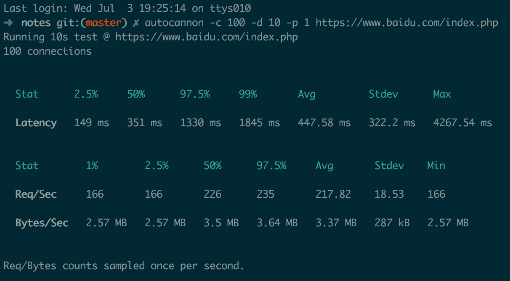
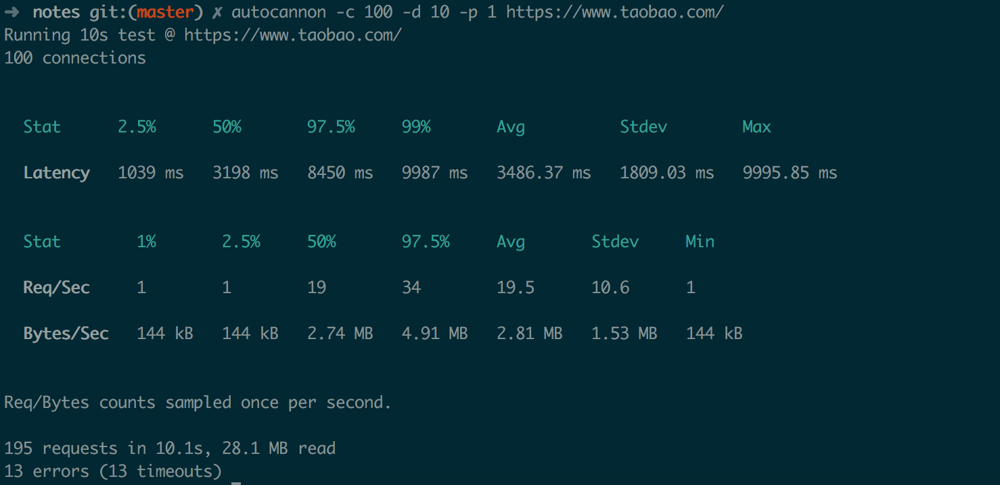

# 性能相关

## 基本概念

* QPS（TPS）：每秒钟 request/事务 数量，在互联网领域，指每秒响应请求数（指http请求）；
* 吞吐量：单位时间内处理的请求数量（通常由QPS与并发数决定）；
* 响应时间：系统对一个请求做出响应的平均时间。例如系统处理一个HTTP请求需要200ms，这个200ms就是系统的响应时间（我认为这里应该仅包含处理时间，网络传输时间忽略）。

QPS ≠ 并发数

并发是指，某个时刻有多少个访问同时到来。QPS是指秒钟响应的请求数量。那么这里就肯容易推算出一个公式：

QPS = 并发数 / 平均响应时间

## 依据访问量推算需要到达的QPS

如果目前日访问量200w pv，QPS：10。根据日常经验，80% 的访问量集中在 20%的时间（二八法则🙂），算一下这 200w pv实际需要机器达到多少qps才能满足。

qps = (200w * 0.8) / (24 * 3600 * 0.2) = 92.6

## 一些网站的QPS
* PC百度首页

* 淘宝首页

测了一下百度和淘宝的qps，这么看的话上面计算qps的方式其实比较糙吧
## 参考
* [Web开发中，什么级别才算是高并发](https://segmentfault.com/a/1190000010844969)
* [什么是QPS，TPS，吞吐量](https://www.jianshu.com/p/2fff42a9dfcf)