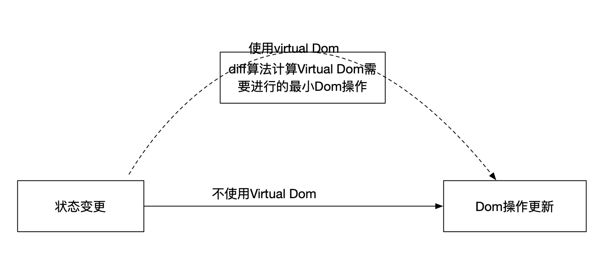

# Virtual Dom

## Virtual Dom 更快？

[别再说虚拟 DOM 快了，要被打脸的](https://mp.weixin.qq.com/s/XR3-3MNCYY2pg6yVwVQohQ)

从流程上来说使用virtual dom增加了一步，所以并不能比直接操作原生Dom更快。

>React 厉害的地方并不是说它比 DOM 快，而是说不管你数据怎么变化，我都可以以最小的代价来进行更新 DOM。 方法就是我在内存里面用心的数据刷新一个虚拟 DOM 树，然后新旧 DOM 进行比较，找出差异，再更新到 DOM 树上
>
>框架的意义在于为你掩盖底层的 DOM 操作，让你用更声明式的方式来描述你的目的，从而让你的代码更容易维护。没有任何框架可以比纯手动的优化 DOM 操作更快，因为框架的 DOM 操作层需要应对任何上层 API 可能产生的操作，它的实现必须是普适的。
>
>针对每一个点，都可以写出比任何框架更快的手动优化，但是那有什么意义呢？在构建一个实际应用的时候，你难道为每一个地方都去做手动优化吗？出于可维护性的考虑，这显然不可能。框架给你的保证是，你在不需要手动优化的情况下，我依然可以给你提供过得去的性能。

## 参考

* [根据 React 历史来聊如何理解虚拟 DOM](http://www.taoweng.site/index.php/archives/293/)
* [别再说虚拟 DOM 快了，要被打脸的](https://mp.weixin.qq.com/s/XR3-3MNCYY2pg6yVwVQohQ)
* [深入理解虚拟 DOM，它真的不快](https://mp.weixin.qq.com/s/cz5DBpqFiadL4IQofiWY3A)
* [网上都说操作真实 DOM 慢，但测试结果却比 React 更快，为什么？](https://www.zhihu.com/question/31809713)