[toc]

#《深入浅出serverless》 读书笔记

## 第1章：Serverless基础

Serverless架构是云计算时代的一种革命性的架构模式

### 1.1 什么是Serverless
Serverless即“无服务器架构”，核心思想是用户无需关注支撑应用服务运行的底层主机（底层服务器的状态、资源（比如CPU、内存、磁盘及网络）及数量），软件应用正常运行所需要的计算资源由底层的云计算平台动态提供。

而传统场景，应用被部署到特定的运行环境，根据业务需要，用户会申请一定数量、一定规格（一定数量的CPU、内存及存储空间）的服务器以满足应用的正常运行。依据实际的运营情况，用户可能会申请更多的服务器资源进行扩容，以应对更高的访问量。用户需要关心服务器的状态，耗费不少精力。

而Serverless架构下，当访问量升高时，云计算平台动态增加应用的部署实例。当应用空闲一段时间后，云计算平台将应用卸载并回收资源。整个过程用户完全不需要关心和维护具体的服务器。

另外，Serverless的实现和软件应用所处的云计算平台关联很大。这个云计算平台可以是公有云如：Amazon Web Services(AWS)、Microsoft Azure、阿里云或腾讯云，也可以是私有云。后面的章节会详细介绍。

### 1.2 Serverless带来的价值

1. 降低运营复杂度

  * 用户不再需要考虑如何规划服务器的数量和规格
  * 无需持续监控和维护具体服务器的状态

2. 降低运营成本

  * 维护应用运行所需要投入的时间和人力将大大降低
  * 多数共有云服务在应用处于空闲状态时用户无需支付费用，私有云环境中，应用空闲时不占用服务器资源，可以带来更高的资源利用率
    > ps.空闲状态时，应用使用到的外部服务比如存储和数据库等仍会产生费用

3. 缩短产品的上市时间

  * Serverless架构下，应用的功能被结构成若干细粒度的无状态函数，功能与功能的边界更加清晰，模块耦合度减少，使得开发效率更高；
  * 无需关注应用依赖的服务（如数据库、缓存等），部署起来也更加容易。

4. 增强创新能力

  * 开发和部署效率的提升，可以用更多的时间、更少的投入进行创意尝试，失败所消耗的时间和金钱成本相对于传统的软件应用架构而言算是比较低的。


### 1.3 Serverless的技术实现

#### 1.3.1 理念与实现

Serverless的核心思想是作为计算资源的服务器不再是用户需要关注的一种资源，从而降低应用运营的工作量和成本。

目前市场上比较流行的Serverless工具、框架和平台有：
* AWS Lambda, 最早被大众认可的Serverless实现
* Azure Functions， 来自微软公有云的Serverless实现
* OpenWhisk, Apache社区开源的Serverless框架
* Kubeless,基于Kubernetes架构实现的开源Serverless框架
* Fission, Platform9退出的开源Serverless框架
* OpenFaaS, 以容器技术为核心的开源Serverless框架
* Fn，来自Oracle的开源Serverless框架

后面的章节将针对关注度较高的公有云AWS及私有云（OpenWhisk，Fission及OpenFaaS）进行详细介绍。

#### 1.3.2 FaaS 与 Baas

FaaS: Function as a Service 函数即服务
Baas: Backend as a Service 后台及服务

FaaS提供了一个计算平台，在这个平台上，应用以一个或多个函数的形式开发、运行和管理，目前业界比较成功的FaaS平台的代表就是[AWS Lambda](https://amazonaws-china.com/cn/lambda/)。应用程序本身实现了Serverless，但是应用所依赖的三方服务比如数据库、分布式缓存及消息队列并没有实现Serverless化。

BaaS平台可以将应用所依赖的三方服务如数据库等服务化并发布出来，用户通过向BaaS平台申请所需要的服务进行消费，而不需要关心这个服务的具体运维。

要想实现Serverless架构，用户必须结合FaaS和BaaS的功能，使得应用整体的系统架构实现Serverless化。

### 1.4 Serverless应用架构

### 1.5 Serverless的技术特点
1. 按需加载
  * 应用并不是一直在线的，只有当请求到达或者事件发生时才会被部署和启动。应用空闲一定时长之后，会被自动停止和卸载。
2. 事件驱动
  * 通过将不同的事件（比如HTTP请求到达、消息队列接收到新的信息或存储文件被修改了等）与特定的函数进行关联实现对不同事件采取不同反应
3. 状态非本地持久化
  * 应用实例的加载和卸载完全由云平台自动控制，且应用与服务器完全解耦，因此应用的状态不能，也不会保存在其运行的服务器上，不能做到传统意义上的状态本地持久化。
4. 非会话保持
  * 无法做到传统意义上的会话保持（Sticky Session），因此，Serverless架构更适合无状态的应用
  > 但并不是说Serverless架构无法妥善处理有状态的场景，后面会对此进行详细介绍
5. 自动弹性伸缩
  * 根据实际访问量自动弹性扩展或收缩应用的实例数量
6. 应用函数化
7. 依赖服务化 （BaaS）

### 1.6 Serverless的应用场景
1. web应用（弹性扩展资源的特性使得那些只是偶尔访问量大的网站以较低的成本抗住偶尔的压力）
2. 移动互联网
3. 物联网
4. 多媒体处理
5. 数据及事件流处理
6. 系统集成

### 1.7 Serverless的局限

1. 控制力；用户无需关注底层的计算资源的反面是对底层计算资源没有控制力，对于需要掌控底层计算资源的应用场景，Serverless架构并不是合适的选择。

2. 可移至性；Serverless应用的实现很大程度上依赖于Serverless平台及该平台上的FaaS和BaaS服务，不同厂商的Serverless平台和解决方案的具体实现并不相同。而且目前Serverless领域尚未形成有关的行业标准，这意味着把一个平台上的Serverless应用移植到另外一个平台时所需要付出的成本比较高。

3. 安全性；不同用户的应用或者同一用户的不同应用在运行时可能共用底层的主机资源。对于一些安全性要求较高的应用，这将带来潜在的安全风险。

4. 性能；应用空闲时会被卸载，当请求再次到达时，平台需要重新加载应用，应用的首次加载和重新加载的过程将产生一定的延时。对于那些对延时敏感的应用需要通过预加载或延长空闲超时时间等手段进行处理

5. 执行时长；大部分Serverless平台对FaaS函数的执行时长存在限制。因此Serverless应用更适合一些执行时长较短的作业。

6. 技术成熟度；新兴技术，成熟度有待提升。

### 1.8 章节小结

## 第2章：Serverless与相关技术

要理解Serverless，需要结合当下业界发展的整个大环境和趋势进行思考

### 2.1 云计算

当前的云计算模式分为：基础架构即服务（Infrastructure as a Service, IaaS）, 平台即服务（Platform as a Service, PaaS）以及软件即服务（Software as a Service, SaaS）
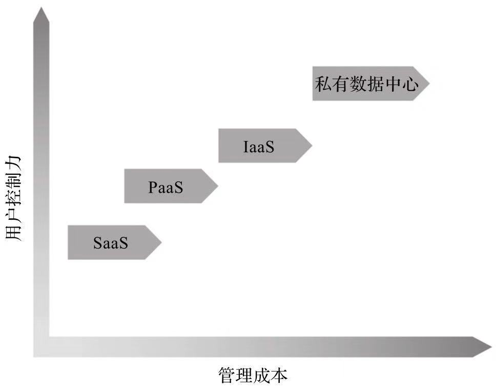

云计算的不断发展是Serverless发展和流行的最大推动因素。Serverless是云计算未来发展的一个方向。

### 2.2 微服务

#### 2.2.1 从SOA到微服务

SOA （Service Oriented Architecture）面向服务架构。SOA提倡应用系统对外暴露功能并提供服务，通过服务的组合形成新的应用。存在的问题是多个模块和功能仍然被包含在同一个应用中、同一个交付件中，这使得各个模块的功能相互交缠，彼此制约。

为了解决SOA没有解决的问题，业界出现了微服务架构这一思想。微服务架构提倡将应用化整为零，减小颗粒度。

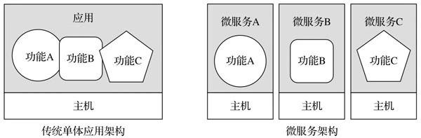

#### 2.2.2 微服务的价值与挑战

* 更清晰的权责，各个微服务之间的职能边界清晰；
* 更快速的开发和交付节奏；每个微服务独立开发和部署，应用不再牵一发而动全身，节奏更快；
* 更灵活的资源扩展；每个微服务独立部署，易于扩展而不影响其他服务；
* 团队组织变化；
* 运维复杂度；单体应用化整为零，需要运维管理的应用实例大大增加。用户需要通过有效的手段降低运维的复杂度，容器是一个好的解决方案；
* 微服务治理；微服务之间的通信、调用链的跟踪管理、状态监控、错误跟踪排查等都需要相应的解决方案；

#### 2.2.3 Serverless与微服务

微服务也是云计算发展的产物。Serverless与微服务都强调功能的结构。但是微服务架构中最小成员单位是微服务，而Serverless架构中的最小成员单位是函数。

微服务强调化整为零，提高应用灵活度；Serverless强调的是“减负”，降低管理复杂度和成本。

微服务架构在架构上带来了灵活性的同时，也增加了开发、部署和运维的复杂度。虽然通过容器等技术可以降低相关的复杂度，但是相对而言，Serverless应用的开发和运维的效率更高，管理成本更低。

Serverless技术具有前瞻性，但是并不是说企业推进微服务架构是徒劳的。Serverless架构实现依赖于强大的云计算平台，并不是每家企业或组织都具备，另外不是每个场景都适合引入Serverless架构。

### 2.3 容器

#### 2.3.1 容器技术的兴起

容器技术以操作系统内核为基础，保证了可移植性，让应用可以在不同的云环境中，甚至非云环境中被方便地迁移。

容器技术可以是Serverless架构中实现的一个基础。容器平台的最小运行单元为容器，将容器内运行的对象变成函数并无技术困难。

### 2.4 PaaS

#### 2.4.1 以应用为中心

#### 2.4.2 Serverless与PaaS

### 2.5 FaaS

#### 2.5.1 Serverless实现的基础

#### 2.5.2 FaaS的架构

一个FaaS平台架构中包含如下重要组件：

* 函数定义
* 函数实例 （在运行状态的应用函数的实例）
* 控制器 （负责应用函数的加载、执行等流程的管理）

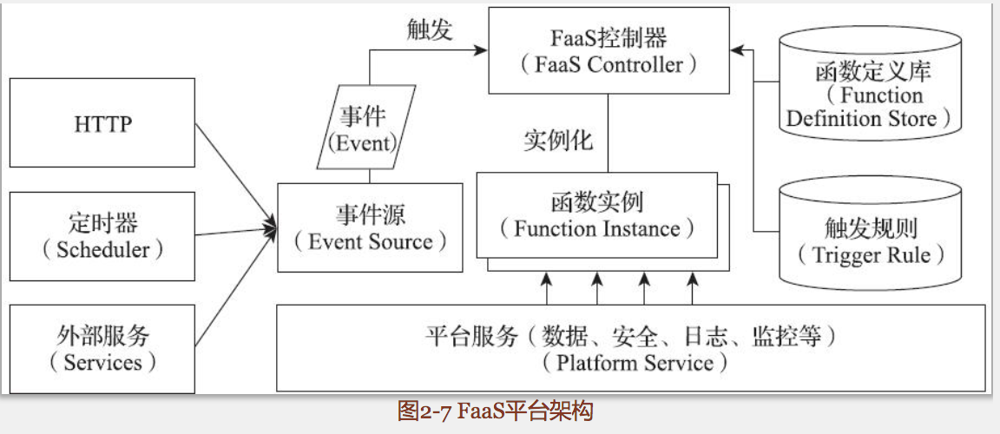

#### 2.5.3 函数的生命周期

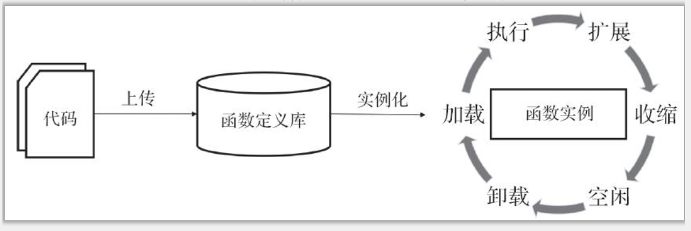

### 2.6 BaaS

#### 2.6.1 BaaS的价值

当前BaaS覆盖的范围比较广，包含应用可能依赖的一切第三方服务，比如对象存储服务、数据库服务、身份验证服务、数据分析服务等。
通过BaaS平台，用户的应用程序可以对接后端的各种服务，省去了用户学习各种技术和中间件的成本，降低的应用开发的复杂度。

#### 2.6.2 广义的Serverless

狭义的Serverless是FaaS，广义的Serverless包含FaaS和BaaS两个方面。

FaaS解决的是应用本身“无服务器化”，BaaS解决了应用依赖的第三方服务“无服务器化”。

### 2.7 NoOps

#### 2.7.1 无人运维吗

NoOps概念认为随着云计算的不断演进，IT最终将进入无需人工运维的阶段。

#### 2.7.2 Serverless与“无人运维”

Serverless下任然需要人对应用的整体运营状态进行维护

### 2.8 DevOps

DevOps强调和谐的开发（Develop）和运维（Operation）的协作，以便提高效率和质量

### 2.9 云原生应用

#### 2.9.1 因云而生

#### 2.9.2 Serverless与云原生应用

Serverless是云原生应用的一种实现

### 2.10 本章小结

## 第3章 Serverless的实现

### 3.1 Serverless技术的发展

Serverless相关资源

* [awesome-serverless](https://github.com/anaibol/awesome-serverless)

Serverless相关资源可分为：

* Serverless平台；提供开发和运行Serverless的基础；
* Serverless框架；不同平台的开发体验和部署不同，框架可以抹平底层不同平台的差异；
* Serverless工具；比如监控管理日志和性能的Dashbird和IO Pipe、持续集成工具LambCI；
* 编程语言库；针对某种语言的Serverless类库；
* 后台服务；比如安全服务Puresec、安全漏洞扫描服务Snyk；
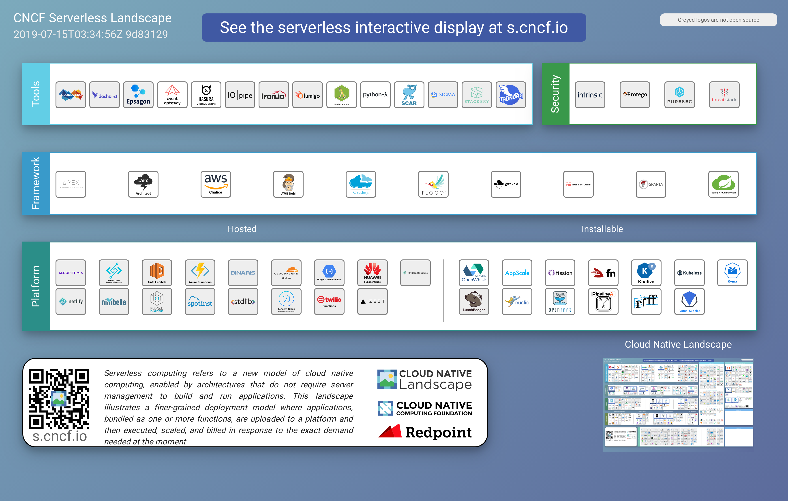

### 3.2 Serverless与公有云

按照云的运维职责可分为公有云、私有云和混合云。

公有云的优点：

* 更低的开销；按需购买资源，节约开支；
* 更低的运维成本；无需再运维各类计算资源，节省了人力；
* 高度可扩展；公有云有能力在短时间内按需迅速扩展；
* 高可用；公有云有能力提供遍布世界的站点和高可用区；

#### 3.2.1 Amazon Web Services

Amazon Web Services即AWS,是目前市场份额最大的公有云服务提供商之一，在五大洲都设有数据中心。

AWS Lambda是AWS针对Serverless架构提出的FaaS云服务。

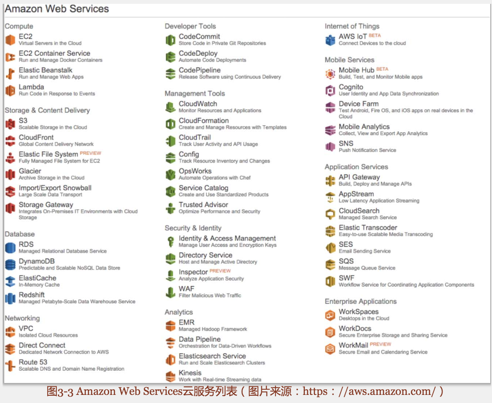

同其他平台相比，AWA Lambda的优势在于：

* 成熟度高；
* 用户基数大；可参考案例多。
* 活跃的社区；
* AWS的整合；AWA Lambda天然和AWS平台上的服务有良好的集成。

#### 3.2.2 Microsoft Azure

Microsoft Azure是由微软推出的共有云服务，目前市场份额位居前列。

Microsoft Azure优点：

* 完整性；Azure Functions具备了一个完备的FaaS所应该具备的技术特点。
* Azure Functions天然与Azure云平台上的各类服务有着良好的集成；
* Azure Functions既提供公有云服务，也提供商业支持的私有化部署版本，可满足不同用户的需求。

#### 3.2.3 Google Cloud Platform

Google Cloud Platform是google推出的公有云服务，与AWS Lambda和Microsoft Azure的区别是Google Cloud Platform目前只支持 Javascript作为函数开发语言，运行环境为Node.js。虽然Google Cloud Platform已于2016年退出，但是长时间处于beta阶段，直到2018年才宣布正式上线。

#### 3.2.4 Webtask

Webtask是Autho公司提供的在线Faas服务。根据官方介绍Webtask非常适用于一些需要少量服务端代码的单页应用（SPA）。
Webtask是一个轻量级Faas平台，目前仅支持 Javascript和C#等语言进行函数编写，运行环境为Node.jS

#### 3.2.5 Hyper.sh

Hyper.sh拾亿贰在线容器运行服务，CaaS平台。与Webtask类似，Hyper.sh来自规模较小的服务提供商，提供轻量级Serverless Faas服务

#### 3.2.6 阿里云

阿里云函数计算平台特点：

* 事件触发
* 支持语言；目前支持的开发语言为Nodejs,计划后续将支持Java及Python
* 用户体验；用户可通过web控制台管理函数应用，也可通过交互式的命令行来操作

#### 3.2.7 腾讯云

特点：

* 函数运行时，目前支持Python、Java及Node.js
* 事件触发

#### 3.2.8 小结

目前AWS Lambda无疑是最大的Serverless平台，Azure Functions和 Google Cloud Functions目前还处于追赶状态，Webtask和Hyper.sh适用于应用场景相对简单的用户，阿里云和腾讯云的Serverless支持还处于建设初期，许多功能亟待完善，实际用户也有待增加。

### 3.3 Serverless与私有化部署

公有云优点是节约了用户大量的管理成本，缺点是削弱了用户对基础架构的控制力。此外，许多用户，尤其是大企业对公有云的安全性表示担忧，因此构建私有云是这些有安全需求用户的选择

下面介绍几种关注度比较高的Serverless实现方案

#### 3.3.1 OpenWhisk

OpenWhisk是一个开源的Serverless Faas平台，源于IBM的Serverless平台，目前由Apache基金会进行孵化和管理。后面的章节再对她进行详细介绍。

#### 3.3.2 Fission

Fission是Platform9公司推出的开源Serverless框架，用户可以在 Kubernetes 集群上运行Fission以提供FaaS平台服务。 Fission目前支持的语言非常广泛，包含各类常见的编程语言，如Node.js、Python、Java、.NET、Go、PHP、Ruby、Perl。Fission还提供了函数的编排能力，通过Fission workflows用户可以定义并执行函数调用链。

#### 3.3.3 Kubeless

Kubeless也是运行在Kubernetes平台上的FaaS, 目前Kubeless支持的编程语言有Python、Ruby、Node.js和PHP。

#### 3.3.4 OpenFaaS

OpenFaaS是一个基于容器技术构建的Serverless FaaS平台，和Fission、Kubeless不同的是，OpenFaaS除了支持Kubernetes外，还支持 Docker Swarm

#### 3.3.5 Fn

Fn是Oracle支持的一个开源Serverless FaaS项目, Fn项目的特点是基于容器技术，支持多个不同容器编排平台，包括 Kubernetes、Docker Swarm 及 Mesosphere,支持不同的私有云和公有云平台上进行部署。

根据Oracle官方消息，Fn可以兼容AWS Lambda的函数代码，用户可以将AWS Lambda的代码导入到Fn中运行。

#### 3.3.6 小结

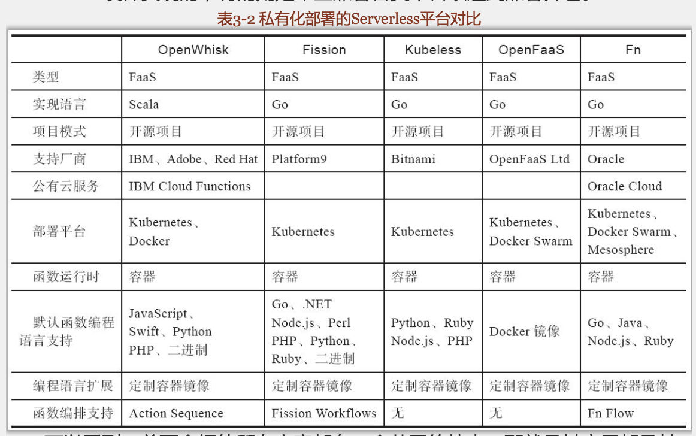

### 3.4 Serverless框架和工具

不同云平台的差异导致Serverless应用的开发和调试变得相对困难。为了解决这个问题，社区出现了一批框架和工具用以帮助用户降低开发、调试和部署的复杂度，提高开发效率。

#### 3.4.1 Serverless Framework

Serverless Framework是一款帮助用户构建、部署和管理在不同Serverless平台之上应用的命令行工具。通过简单的命令，用户可以将应用发布到指定的Serverless平台上。当前支持的平台有：AWS Lanbda、Azure Cloud Functions、Google Cloud Functions、IBM OpenWhisk、Kubeless以及Webtask等。

#### 3.4.2 Chalice

Chalice是AWS官方支持的开源项目，用于简化用户定义和部署AWS Lambda应用。

#### 3.4.3 Claudia.js

Claudia.js是一个基于nodejs实现的AWS Lambda部署工具。只支持管理Node.js AWS Lambda应用

#### 3.4.4 Apex

Apex是一款基于Go实现的AWS Lambda部署工具，支持多种语言，如：Node.js、Python、Java、Go等默认语言，同时还可以通过Shim支持AWS Lambda原生不支持的语言，如Rust何Clojure等。

#### 3.4.5 Spring Cloud Function

Spring Cloud Function 是Spring针对Serverless架构推出的一个新项目。

#### 3.4.6 AWS SAM

AWS SAM （AWS Serverless Application Model）,它是AWS推出的一个Serverless应用的定义规范。

#### 3.4.7 小结

Serverless框架对比

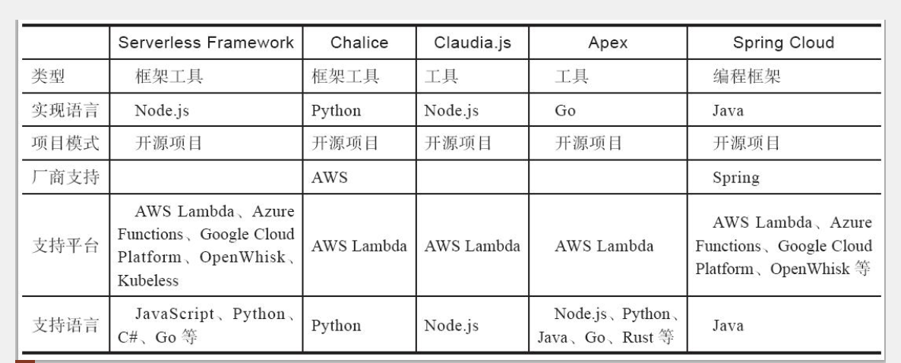

### 3.5 Serverless后台服务

Serverless应用所依赖的第三方服务也需要无服务器化

1. 公有云服务

比如AWS的数据库服务DynamoDB、Azure的数据库服务Cosmos DB等。用户只需要按需购买所需的服务即可，而不需要花费精力去管理这些服务底层的基础架构

2. 私有云服务

同公有云服务一样，只是部署在私有云

### 3.6 本章小结

## 第4章 AWS Lambda

### 4.1 AWS

AWS自2002年推出，经过十余年发展，发展已相当成熟，涵盖诸多领域。

### 4.2 AWS Serverless

AWS Lambda不等于 AWS，AWS Lambda是Serverless的 FaaS部分。AWS平台还提供了AWS Lambda 消费所需的其他Serverless服务。

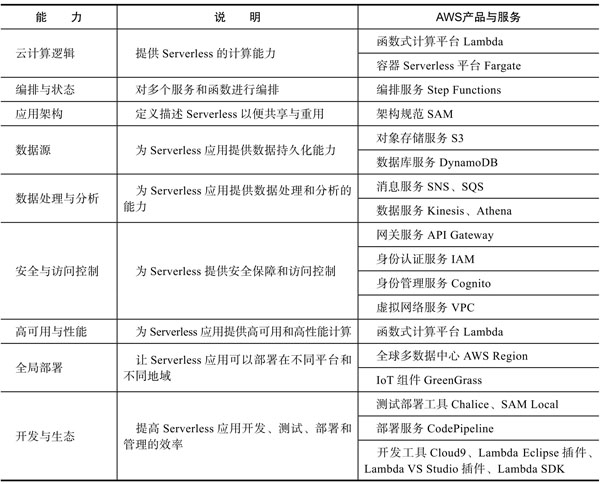

### 4.3 AWS Lambda概述

AWS Lambda是一个事件驱动的函数计算平台。通过AWS Lambda，用户可以定义函数代码逻辑。AWS Lambda负责在特定的事件发生的时候执行用户的代码逻辑。当有同时有多个请求到达时，AWS Lambda负责根据负载实例化若干个用户代码逻辑的实例响应请求。用户不需要关心运行这些代码逻辑的底层计算资源，只需要专心实现业务需求的代码逻辑。

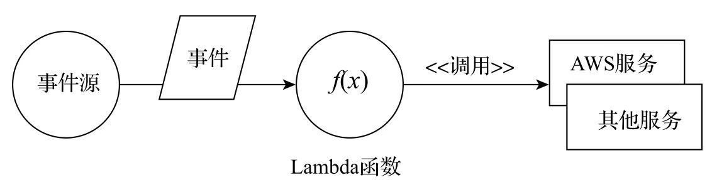

#### 函数

函数是AWS Lambda的执行单元，它往往是一段无状态的代码片段。函数定义以用户需要执行的业务逻辑。用户可以使用Node.js、Python、Java、C#及Go等语言编写函数逻辑。

#### 事件源

事件源是触发AWS Lambda函数执行的触发方。事件源可以是AWS上的云服务，也可以是第三方的额应用服务。

#### 事件

事件描述了触发AWS函数的原因，包含了来自事件源的详细信息。事件可以作为函数的输入参数。函数根据事件的具体信息进行业务处理。

### 4.4 第一个Serverless应用

#### 4.4.1 注册AWS账号

目前新注册的用户可以获得一部分免费优惠。默认每月有100W次免费调用。

#### 4.4.2 AWS Lambda 控制面板

https://console.aws.amazon.com/console/home

在控制台中搜索Lambda服务

#### 4.4.3 创建函数

#### 4.4.4 编辑函数

#### 4.4.5 测试函数

#### 4.4.6 外部访问

"添加触发器-API Gateway", 这样就可以通过外部访问服务了

#### 运维监控

### 4.5 权限控制

Lambda函数代码的运行受到AWS平台权限模型的严格管控，创建函数时需要选择相应的权限角色，这个角色赋予了函数在运行时对相应资源的访问权限。

#### 4.5.1 IAM

AWS IAM 是AWS平台权限管理的核心服务。在IAM中用户可以定义 用户、组、角色和策略进行权限管理。

#### 4.5.2 策略

策略是AWS权限模型中的规则，其中定义了权限所有者可以对什么服务的什么资源进行什么操作。

#### 4.5.3 角色

角色是IAM权限的一种组织方式。用户可以将若干个定义好的策略规则赋予给某个角色，然后再将该角色赋予某个用户或者组，这样相关的用户和组成员就具备该角色所关联的权限了。

### 4.6 编程模型

#### 4.6.1 代码开发

用户可以在线编辑代码，也可以将写好的代码通过压缩包的形式从本地或者Amazon S3存储中上传到Lambda平台。并不是所有语言都支持在线开发，目前只支持Node.js和Python的在线开发。

#### 4.6.2 Handler

Handler是一个lambda函数的执行入口

```js
exports.handler = function(event, context, callback) {
  // ...
}
```

#### 4.6.3 执行上下文 context对象

context对象中可以获取到

* 当前执行实例的函数名称、版本号、资源唯一标识、内存限制、剩余执行时间；

* 当前执行实例的AWS Request ID

* 当前执行实例的日志组名、日志流名称

* 当调用客户端为AWS Mobile SDK应用时，用户可以获取客户端的信息

#### 4.6.4 日志输出

用户可以在Lambda函数内输出日志信息，并被AwS平台收集

#### 4.6.5 异常处理

当函数执行出现错误时，或者函数主动抛出异常时，Lambda将会捕捉到异常信息，并以JSON对象的形式将异常信息返回。

#### 4.6.7 无状态

用户无法预知函数究竟在哪台具体的机器上执行，并且函数可能是以多个实例的形式执行。因此在编写函数的时候要保证函数是无状态的。当需要依赖状态时，可以通过外部的持久化服务解决，比如数据库服务Amazon DynamoDB或者对象存储服务Amazon S3

### 4.7 事件驱动

#### 4.7.1 事件源

Lambda 函数支持的事件源有：
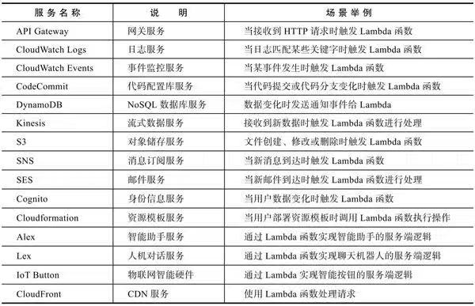

除了上面列举的AWS服务之外，用户也可以通过AWS的SDK或者第三方应用中通过Lambda的Invoke API实现触发AWS Lambda函数。

#### 4.7.2 触发模式

当手动触发一个Lambda函数时，用户可以选择同步模式或者异步模式。函数的调用模式往往和其关联的事件源相关。各种服务触发的实现机制并不是完全相同的。Lambda函数的触发事件机制有两种：一种是推（Push）模式,一种是拉（Pull）模式。

##### 推模式

前文列举的AwS服务可以分为两类，一种是基于数据流（Stream) 的服务，一种是非流式的常规AWS服务，Kinesis数据服务和DynamoDB数据库的更新通知是属于流式的数据服务，其他大部分的服务为非流式的常规AwS服务。

对于常规的AwS服务，函数的触发方式是推模式，即事件源主动触发Lambda函数，推送事件。

##### 拉模式

流式数据服务则是采用拉模式，即Lambda服务主动持续地轮询事件源。

### 4.8 日志监控

#### 日志
AWS Lambda函数运行所输出的日志会被CloudWatch Logs 服务收集。在CloudWatch服务的控制台中可以找到Lambda函数相关的日志信息。

#### 监控

除了日志之外，CloudWatch服务还收集了Lambda函数的相关性能指标。

### 4.9 开发辅助

Lambda除了提供函数计算环境之外，还提供了一系列提高开发效率的功能，比如环境变量、标签和版本控制等。

#### 4.9.1 环境变量

有些配置项在开发、测试、生产环境往往都是不一样的。通过环境变量配置不同的配置项，便于管理。

#### 4.9.2 标签

创建Lambda函数时并没有项目或者应用的概念。所有函数默认都是在一个大列表中。Lambda函数的组织是通过标签（Tag）来实现的。用户可以根据需要添加任意键值对形式的标签。通过标签的过滤和筛选，用户可以将函数进行分组，达到组织的效果。

#### 4.9.3 版本控制

用户可以对函数的代码进行版本控制。除版本之外，还支持别名（Alias）。别名就像指向某个特定版本的Lambda函数的指针，用户可以通过别名引用Lambda函数，而无需关心其具体指向的版本号。别名还具有流量分发的作用，用户可以在两个版本的Lambda函数之间按照权重比例分发流量，这相当于为Lambda函数实现了灰度发布的功能。

### 4.10 运行限制

虽然AWS平台拥有海量的计算资源，但是Lambda函数所能使用的资源并不是无边无际的，Lambda对函数定义了一系列的资源限制。

#### 4.10.1 资源限制

资源限制：
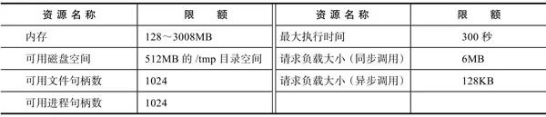

#### 4.10.2 并发控制

默认每个AwS账户在每个AWS区域的Lambda函数的并发最大值为1000个实例。如果用户有更高的性能要求，可以联系客服提供并发的上限值。

用户可以在Lambda中为一些函数预留一定的执行并发实例数。比如用户有100个Lambda函数，其为某个函数保留了100个执行并发，那么其他99个函数所能到达的并发实例最大则为900个。这样可以确保一些重要的函数在执行时总是有足够的资源。

#### 4.11 配置与部署

我们可以通过web控制台直观地进行Lambda函数的创建和配置，缺点是依赖于人工，不能自动化。AwS为Lambda建立了一套架构描述规范SAM，通过基于YAML格式的SAM描述文件，用户可以定义一个具体的Lambda函数的各类配置信息，如运行环境、资源限制、API网关、权限等。通过SAM，用户实现了Lambda函数配置的代码化，使得这些配置可以被纳入代码版本管理中，并实现自动化部署和配置。

通过SAM定义Lambda应用后，在正式部署前还需要进行本地测试。通过SAM Local，用户可以在本地环境中运行和调试SAM定义的AwS应用。

### 4.12 本章小结

## 第5章 Azure Functions

### 5.1 Microsoft Azure

### 5.2 Azure Functions概述

微软在2016年推出其Serverless计算平台Azure Functions。
Azure Functions的主要特点有：
* 多语言支持（C#、F#及JavaScript等语言）
* 按量付费
* 易于与Azure公有云上众多的云服务集成
* 提供了各种代码管理工具和开发工具的集成，如Github、Visual Studio等
* 除了私有云服务外，还提供了可以在史有云部署的版本
* Azure的函数运行环境是开源的，用户可以在Github上查看其源码

### 5.3 创建Azure Serverless应用

#### 5.3.1 注册Azure账号

Azure目前对新用户提供部分服务12月免费试用，提供Azure Functions 每月100万次的免费调用。

#### 5.3.2 Azure控制台

#### 5.3.3 函数应用

#### 5.3.4 创建函数

### 5.4 Azure Functions命令行

除了基于web的控制台，Azure还提供了命令行工具Azure Functions Core Tools进行函数应用部署和管理

#### 5.4.1 安装命令行

#### 5.4.2 创建本地函数

#### 5.4.3 测试本地函数

#### 5.4.4 发布至公有云

### 5.5 深入了解Azure Functions

#### 5.5.1 函数应用设置

#### 5.5.2 Trigger与Bindings

#### 5.5.3 函数代理

#### 5.5.4 Slot

### 5.6 私有云部署

### 5.7 本章小结

## 第6章 容器技术基础

### 6.1 什么是容器

让用户可以在操作系统上构建一个相对隔离的环境。

#### 6.1.1 容器

从技术上，容器其实就是操作系统的一个受控进程。和传统虚拟化技术相比，容器技术更加地轻量化，可以更充分地利用计算资源，实现更高的计算密度。

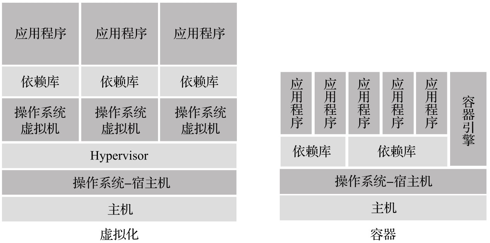

#### 6.1.2 容器镜像

容器镜像是Docker对应用进行打包的一个格式。容器镜像不仅包含应用，还可以包含应用的依赖组件和配置。通过简单的一条命令，用户可以快速地通过容器镜像生成一个或多个容器应用的实例。基于容器的应用部署效率大大超越了基于物理机和虚拟机的应用部署效率。

除了能极大地加速应用部署外，容器的另一个特点是容器镜像往往是由多个层组成的。用户可以基于已有的镜像构建新的镜像，这使得容器镜像有了极大的重用性。容器镜像的分层结构使得多个不同的镜像可以共享相同的层，这使得镜像在网络传输过程中的效率得到了优化。这是传统的虚拟机镜像所不能媲美的。

#### 6.1.3 镜像仓库

Docker提出了容器镜像仓库的概念。容器镜像的拥有者可以将容器镜像发布到镜像仓库。使用容器镜像时可以通过镜像仓库下载所需要的镜像。镜像仓库是的容器镜像的共享和传输变得十分便利。

镜像仓库分为共有仓库和私有仓库。

#### 6.1.4 容器编排

Docker是一个容器引擎。在当前的应用架构下，应用往往不只是部署在一台主机上，而是上百台或者上千台的计算集群。用户需要一种有效的手段去管理成百上千主机上的容器引擎。于是容器编排技术诞生了。Kubernetes是Google推出的一个开源容器编排项目，也是目前市场上最受欢迎的容器编排平台。

#### 6.1.5 容器与Serverless

容器技术对Serverless计算平台的支持主要有以下三个方面：

* 容器环境和镜像为FaaS函数应用提供了一种可以适配各类编程语言的运行环境和部署格式

* 容器引擎可以为Serverless Faas函数实例的运行提供隔离和可控的环境

* 容器编排平台可以为Serverless应用的弹性扩展提供所需的各类计算资源。

### 6.2 Docker

Docker是一个开源容器引擎，通过Docker，用户可以构建、运行和管理Docker容器。

#### 6.2.1 Vagrant

为了方便执行演示实验，推荐读者使用Vagrant对虚拟机环境进行管理。Vagrant可以帮助用户快速地启动和配置VirtualBox、VMWare等虚拟化工具的虚拟机实例。

#### 6.2.2 VirtualBox

#### 6.2.3 安装Docker

#### 6.2.4 运行容器

执行 `docker run`运行一个容器。

`docker ps`查看系统正在运行的容器列表。

`docker exec` 在容器环境内执行命令

`docker stop {name}` 停止容器实例

`docker rm {name}` 删除已停止的容器实例

#### 6.2.5 构建容器镜像

`docker images`查看已经下载到本地的镜像列表。

#### 6.2.6 分享镜像

构建镜像完毕之后，镜像在当前构建主机。通过`docker push`可以将镜像推送到远程镜像仓库供其他用户使用。
通过`docker tag`用户可以对镜像的名称进行修改，加入镜像仓库的信息。
```bash
docker tag my-httpd:1.0 my-registry.example.com/my-httpd:1.0
```
镜像名称修改完毕之后，通过docker push就可以将镜像推送到指定的仓库中。

然后其他用户可以通过`docker pull`命令将镜像从镜像仓库中下载到其主机上运行。

```bash
docker pull my-registry.example.com/my-httpd:1.0
```

更多docker知识可以参考 开源教程[Docker--从入门到实践](https://yeasy.gitbooks.io/docker_practice/)

### 6.3 Kubernetes 基础

#### 6.3.1 命名空间

命名空间的作用是进行资源的组织，它类似于文件系统中文件夹的作用，用来分隔不同的资源。用户一般会将用途相关的一些对象放在同一个命名空间中进行管理。

#### 6.3.2 Pod

Pod是一种特俗的容器，当用户运行一个容器应用时，该容器应用的容器可以认为是运行在这种名为Pod的特殊容器之中的。一个Pod可以包含一个或者多个容器。大多数情况下，一个Pod内只会包含一个容器，因此可以简单地认为Pod就代表我们所要运行的容器应用的容器。在Kubernetes中，应用调度和扩展是以Pod为单位的。

#### 6.3.3 Service

Service是Kubernetes中的一种资源对象。Kubernetes可以作为多个Pod实例的前端，实现流量的负载均衡。

#### 6.3.4 Deployment

Deployment是Kubernetes描述容器部署信息的资源对象。Deployment对象详细记录了用户需要部署的容器镜像地址、部署的实例数量及配置等信息。

#### 6.3.5 ReplicaSet

ReplicaSet是Kubernetes中负责监控容器实例状态的资源对象，其保证实际运行的容器实例数量和用户定义的容器实例数量相符。

#### 6.3.6 网络

#### 6.3.7 Ingress

Ingress是Kubernetes将集群内部的服务对外发布的一种方式。Kubernetes集群内部的容器IP地址和Service IP地址默认都是虚拟地址。集群以外的主机并不能识别这些虚拟的IP地址。通过Ingress这种机制可以让集群外部的主机能访问集群内部的容器实例服务。Ingress的作用类似于反向代理。

#### 6.3.8 交互工具

### 6.4 构建Kubernetes环境

### 6.5 Kubernetes实战

#### 6.5.1 部署容器

#### 6.5.2 弹性扩展

#### 6.5.3 服务发现

#### 6.5.4 资源组织

#### 6.5.5 容器调度

#### 本章小结

## 第7章 OpenWhisk

OpenWhisks是一个开源的Serverless计算平台。

### 7.1 OpenWhisk项目

项目起源于IBM研究院，2016年IBM将其开源。

### 7.2 Hello Whisk

### 7.3 逻辑架构

#### 7.3.1 Namespace

#### 7.3.2 Package

#### 7.3.3 Action

#### 7.3.4 Feed

#### 7.3.5 Trigger

#### 7.3.6 Rule

### 7.4 系统架构

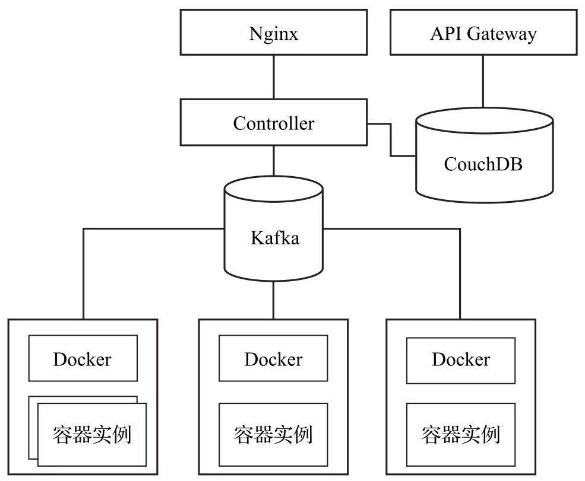

### 7.5 Kubernetes部署

### 7.6 Helm部署

由于架构的复杂性，部署过程可能涉及许多步，Helm项目的目的就是为了简化Kubernetes上容器的部署和管理

### 7.7 蛋糕管理服务例子

### 7.8 本章小结

## 第8章 Kubeless

### 8.1 Kubeless项目

Kubeless是一款基于Kubernetes的功能实现的Serverless框架，项目的定位是增强Kubernetes的能力，使Kubernetes的应用场景可以延伸至Serverless FaaS领域。

#### 8.1.1 系统架构

#### 8.1.2 运行时

### 8.2 Kubeless概述

### 8.3 Function

### 8.4 Trigger

### 8.5 本章小结

## 第9章 Fission

Fission也是一款基于Kubernetes的功能实现的Serverless框架

### 9.1 Fission项目

Fission有Platform 9公司开源

### 9.2 部署Fission

### 9.3 深入探讨Fission

### 9.4 执行模式

### 9.5 Workflows定义

### 9.6 本章小结

## 第10章 OpenFaaS

OpenFaaS是Docker社区的一款Serverless框架

### 10.1 OpenFaaS项目

### 10.2 初识OpenFaaS

### 10.3 OpenFaaS函数

### 10.4 Watchdog

### 10.5 监控

### 10.6 弹性扩展

### 10.7 函数应用市场

### 10.8 本章小结

## 第11章 Serverless的落地与展望

### 11.1 Serverless的落地

### 11.2 Serverless平台建设

#### 11.2.1 公有云

#### 11.2.2 私有云

#### 11.2.3 混合云

### 11.3 Serverless应用架构转型

#### 11.3.1 开发模式

#### 11.3.2 设计原则

#### 11.3.3 迁移与重构

### 11.4 Serverless的未来

#### 11.4.1 建立行业规范

#### 11.4.2 完善工具链

#### 11.4.3 深入结合容器

### 11.5 本章小结
