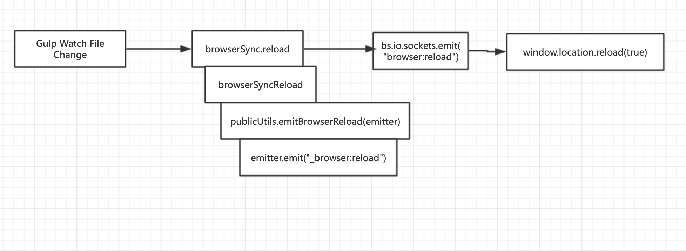

[toc]

# webpack热重载

## [W]是什么
[doc:concepts:hot-module-replacement](https://webpack.js.org/concepts/hot-module-replacement/)
热重载Hot Module Replacement（HMR）是指在应用运行过程中不刷新页面的同时完成模块的修改、添加、删除，从而更新应用。

## [H]怎么用

[doc:guides:hot-module-replacement](https://webpack.js.org/guides/hot-module-replacement/)


1. 配置开启hot模式

```js
 module.exports = {
    // ...
    devServer: {
      // ...
      hot: true, // webpack 会使用内置的HMR plugin
    },
 }
```

2. 模块文件中添加HMR handlers

如果模块并没有HMR handlers，更新操作会冒泡到它的父模块

```js
  import _ from 'lodash';
  import printMe from './print.js';

  function component() {
    const element = document.createElement('div');
    const btn = document.createElement('button');

    element.innerHTML = _.join(['Hello', 'webpack'], ' ');

    btn.innerHTML = 'Click me and check the console!';
    btn.onclick = printMe;

    element.appendChild(btn);

    return element;
  }

  document.body.appendChild(component());

  // 添加HMR handlers
  if (module.hot) {
    // 子模块'./print.js'变更时做相应的处理
    module.hot.accept('./print.js', function() {
      console.log('Accepting the updated printMe module!');
      printMe();
    })
  }
```

### HRM诱发的潜在陷阱

更新的模块会重新执行，如果模块中存在产生“副作用”的逻辑，需要手动调用module.hot.dispose消除。

```js
var sideEffectNode = document.createElement("div");
sideEffectNode.textContent = "Side Effect";
document.body.appendChild(sideEffectNode);

// Remove the most recently-added <div> so that when the code runs again and
// adds a new <div>, we don't end up with duplicate divs.
if (module.hot) {
  module.hot.dispose(function() {
    sideEffectNode.parentNode.removeChild(sideEffectNode);
  });
}
```

### HMR with Stylesheets

使用`style-loader`时，就能够直接获得css模块的HRM功能
```js
// ...
   module: {
     rules: [
       {
         test: /\.css$/,
         use: ['style-loader', 'css-loader'],
       },
     ],
   },
```

## 热重载原理探究

### 从Gulp项目自动刷新页面开始说起

我们可以先不深入研究webpack，从比较简单的gulp入手，在gulp的使用中我们通过[browser-sync](https://www.npmjs.com/package/browser-sync)启动静态文件服务，并通过gulp.watch监听文件变更,然后调用reload刷新页面
```js

var browserSync = require('browser-sync').create();
var reload = browserSync.reload;
gulp.watch('*.html',reload)
```
进一步看`browser-sync`源码，我们可以发现大致流程是这样的：

1. gulp.watch监听到文件变更；
2. 调用browserSync.reload方法；
3. socket.io向浏览器客户端页面发送了`browser:reload`事件，
4. socket.io客户端接收到`browser:reload`事件之后，调用`window.location.reload()`实现页面刷新。(客户端页面在启动时注入了socket.io-client相关的代码)



### webpack热重载


## 其他问题

### react中组件变更之后如何进行热重载

#### 方式1-webpack hot load

```js
// 入口index.js中
renderApp(App)

if (module.hot) {
  module.hot.accept('./pages/app', () => {
    const NextApp = require('./pages/app').default
    renderApp(NextApp)
  })
}
```
这种方式在文件变更之后整个App重新渲染，只解决了页面不刷新的问题，App下组件的状态会丢失

#### 方式2-react-hot-loader
* [react-hot-loader](https://github.com/gaearon/react-hot-loader)

```js
import { hot } from 'react-hot-loader';
const App = () => <div>Hello World!</div>;
export default hot(module)(App);
```
这种方式App下组件的状态可以保留。==（但是有一些副作用，原理待了解）==

## 参考

* [doc:concepts:hot-module-replacement](https://webpack.js.org/concepts/hot-module-replacement/)
* [doc:guides:hot-module-replacement](https://webpack.js.org/guides/hot-module-replacement/)
* [react-hot-loader](https://github.com/gaearon/react-hot-loader)
* [vue-loader](https://github.com/vuejs/vue-loader)
* [轻松理解webpack热更新原理](https://juejin.im/post/5de0cfe46fb9a071665d3df0)
* [搞懂webpack热更新原理](https://juejin.im/post/5d6d0ee5f265da03f66ddba9)
